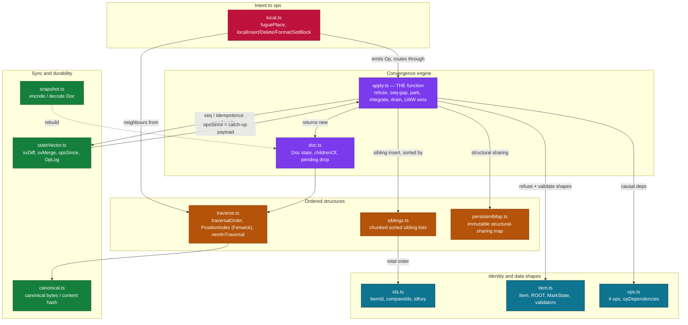

# Weft — current implementation context

> This file is fed to an external AI as the single source of truth for Weft. It is written to be exhaustive and interview-ready: it defines the trending terms, the architecture, the redesigned UI, the current deploy, and (at the end) the likely interview questions with answers. Read it top to bottom.

> Evidence snapshot: 14 September 2026 IST. Canonical repository: `D:\Code\Weft`. The **live site is `https://weft-abheet.fly.dev`, served from the `redesign-glass` branch**, which re-skins the product into a glass **app shell** (a left nav rail, a **Documents** library, and **History** / **Settings** screens) over the same live document session; the underlying CRDT/sync/store engine is unchanged from the feature-complete S1–S8 build. The prior release candidate fixed command-palette focus restoration, added a browser-level all-CTA/recovery matrix, and made `/health` report the build's exact source SHA. `MEMORY.md` and the external sign-off evidence record the tested and deployed commit; this file does not hard-code its own commit hash because changing that text would create a different commit.
>
> Current source and executable tests win if an older design note disagrees. A dirty working tree is a candidate, a green local run proves only those bytes, and a configured URL is not deployment evidence. Public release proof requires `source SHA -> CI -> image/Fly release -> /health SHA -> browser smoke`.

## Product contract

Weft is an offline-first collaborative rich-text editor. Two browser peers can edit one document, disconnect, continue locally, reconnect, and converge without a conflict dialog. A deterministic Fugue-style sequence CRDT carries text and rich-text operations; IndexedDB keeps the local log; a WebSocket relay validates, durably appends, acknowledges, and fans out operations. It has no accounts, document authorization, end-to-end encryption, tables/images/nested lists, or demonstrated multi-region scale.

The redesigned surface is a glass **app shell**: a left **nav rail** with four destinations — **Documents** (a local registry of the documents this browser has opened; there is no server-side index because there are no accounts), **Editor**, **History**, and **Settings**. Documents is the "/" landing and fully unmounts the live session; Editor/History/Settings share one WebSocket connection, so switching screens costs nothing on the wire. Everything the previous single-screen editor did — the persistent toolbar, the Outline/People/Sync rail, presence, time-travel, the ⌘K palette, the honest status pill — is preserved inside that shell.

## Architecture and end-to-end flow

```text
ProseMirror transaction -> binding/toOps -> local CRDT
  -> IndexedDB commit -> WebSocket protocol
  -> relay validation -> append + fsync -> acknowledgement/fanout
  -> peer CRDT -> binding/toTransaction -> peer editor
```

`packages/crdt` is pure convergence logic. `packages/protocol` owns validation and wire limits. `packages/client` owns ProseMirror binding, local persistence, session state, presence, history, and React UI. `packages/server` is a durable relay/log writer and must not import CRDT semantics. Reconnect exchanges state vectors and safely replays duplicates. “On device” means IndexedDB committed but not server-acknowledged; “Saved” means append, `fsync`, and acknowledgement completed.

The redesigned UI adds a thin navigation layer that does not touch that engine. `ui/App.tsx` owns which of the four screens is active plus the per-device look prefs (theme/accent/reduce-transparency, persisted in guarded `localStorage`). `ui/NavRail.tsx` is the left icon rail. `ui/Documents.tsx` renders the local recents registry (`ui/recents.ts`); “New document” and opening a card are real navigations (`location.assign('/d/<id>')`), the same door the editor already used. `ui/Shell.tsx` hosts the Editor/History/Settings screens over one live `useSession`; selecting Documents unmounts Shell so the socket and IndexedDB handle are released by the normal cleanup path. Deployment: a Docker image supervises the loopback `ws` relay and Caddy as one process on Fly.io; `GET /health` returns `{status, release}` where `release` is the source SHA injected at build time.

## How to run and verify

Node 22+; npm workspaces (`crdt`, `protocol`, `client`, `server`). From a clean clone:

- `npm install` — install workspace deps.
- `npm run dev` — runs `tools/dev.mjs`: the relay on `ws://127.0.0.1:4200` and the Vite client on `http://127.0.0.1:5173`, both stopped together. Open the client, create a **New document**, then open the same `/d/<id>` in a second window to see convergence.
- `npm run dev:server` — the relay alone (`node packages/server/src/main.ts`); honours `WEFT_PORT` and `WEFT_DATA_DIR`.
- `npm run check` — the full CI gate: `typecheck` → `lint` (ESLint + `tools/lint-deps.mjs` package-direction + `tools/lint-pure.mjs` purity boundaries) → `test` (unit + property) → coverage gates → `bench` (100k-op benchmark) → `e2e` (Playwright). Husky repeats lint + typecheck pre-commit; GitHub CI repeats the whole gate on Windows and Linux.
- `npm test` — Vitest across all workspaces. `npm run e2e` — Chromium Playwright against a production Vite build + an ephemeral relay. `npm run bench` — the deterministic benchmark. `npm run docs:check` — validates repository links.
- `node packages/crdt/examples/two-replicas.mjs` and `node packages/client/examples/two-headless.mjs` — prove convergence without a browser.

Deploy: one Docker image supervises the loopback `ws` relay and Caddy as one process on Fly.io (`fly.toml`, region `sin`, one always-on machine, a `weft_data` volume for the logs). Caddy serves the built SPA, reverse-proxies `/ws*` to `127.0.0.1:4200`, and answers `GET /health` with `{"status":"ok","release":"<WEFT_RELEASE_SHA>"}` — the source SHA injected at build time and the only trusted proof of what is live.

## Code map

| Path | Responsibility |
| --- | --- |
| `packages/crdt/src` | operation identities, Fugue ordering, tombstones, formatting metadata, state vectors, snapshots, and canonical hash |
| `packages/protocol/src` | bounded wire codecs and validation |
| `packages/client/src/binding` | ProseMirror transaction/position/rich-text translation |
| `packages/client/src/session; packages/client/src/store` | connection state, acknowledgement semantics, IndexedDB, and preferences |
| `packages/client/src/history; packages/client/src/ui` | local inverse-op undo, historical view, toolbar, presence, diagnostics, and accessibility |
| `packages/client/src/ui/App.tsx; NavRail.tsx; Documents.tsx; Shell.tsx; recents.ts; uiPrefs.ts` | the redesigned glass app shell: screen routing, the nav rail, the Documents library over the local recents registry, and per-device look prefs |
| `packages/server/src; packages/server/src/log/appendLog.ts` | WebSocket rooms, durable append, acknowledgement, fanout, and limits |
| `docs/01-DESIGN.md; docs/02-LLD.md; DESIGN.md` | normative algorithm, invariants, slices, and UX |
| `docs/VERIFICATION.md; docs/DEPLOY.md` | current reproducible gates and release operations |

## Invariants and trust boundaries

- Every inserted item has a permanent `(replica, counter)` identity; sibling placement and traversal are deterministic across arrival orders.
- Deletes create tombstones; replay cannot resurrect deleted content. Operations are idempotent and carry causal dependencies.
- Formatting resolves through logical metadata, never wall-clock arrival time. Equal logical state produces equal canonical bytes/hash.
- Undo emits new local inverse operations; it never rewinds global history.
- Unsafe link schemes are rejected before local persistence or replication.
- The server relays/persists operations but does not decide document meaning. Save copy must keep local-versus-durable states honest.

## User workflows to preserve

- Land on the **Documents** library, create a **New document** (a real navigation to a fresh `/d/{id}`), reopen a card from the local registry, and forget one; switch between the Documents/Editor/History/Settings screens via the nav rail.
- Edit one `/d/{id}` from two peers, disconnect one, edit both, reconnect, and verify no-loss convergence plus durable save states.
- Use inline formatting, colors/highlights, links, headings, lists, checklist, quote, code block, divider, undo/redo, and invalid-link recovery.
- Inspect Outline navigation, People/presence/follow, Sync state vector/hash/diagnostics, History slider/authors/return-to-live, and the command palette.
- Change name/document title/theme/accent/transparency/sidebar from Settings or ⌘K, copy the state vector, simulate offline/drop messages, and use the 320 px editor path.

## Concepts this project teaches

| Concept | How it appears here |
| --- | --- |
| Conflict-free replicated data types | commutative/idempotent operations plus deterministic Fugue ordering produce convergence |
| Causality and state vectors | replica counters summarize known history and drive catch-up |
| Tombstones and snapshots | logical deletion preserves references; snapshots bound startup/replay work |
| Durability semantics | IndexedDB commit, socket send, append, `fsync`, and acknowledgement are different milestones |
| Editor binding | ProseMirror positions are translated to stable CRDT identities and back |
| Property-based testing | random arrival orders and operation sequences attack convergence, no-loss, and canonicalization |

## Trending terms, explained

Plain-language definitions of the vocabulary a reader or interviewer will hit, each grounded in how it appears in Weft.

- **CRDT (Conflict-free Replicated Data Type):** a data structure whose concurrent edits merge deterministically with no central coordinator and no conflict prompt, because the merge is defined by the data, not by a lock. Weft's document is a CRDT.
- **Fugue:** the specific list/sequence CRDT algorithm Weft implements (Weidner & Kleppmann, 2023). Its defining property is *maximal non-interleaving*: when two people type at the same spot, their runs stay as whole branches instead of interleaving letter-by-letter. Modelled here as an explicit tree where each character is the left/right child of its neighbour.
- **Operation-based (op-based) CRDT:** convergence is carried by a stream of small commutative, idempotent operations (insert/delete/format) rather than by shipping whole-state snapshots. Weft appends ops to a log and replays them.
- **State vector / version vector:** a compact map `replica -> highest counter seen`. On reconnect two peers swap vectors to compute exactly which ops the other is missing — the whole catch-up protocol, no diffing of content.
- **Tombstone:** a deleted character is marked dead, not removed, so a late-arriving op that references it still has a valid neighbour. Prevents "resurrection" bugs; the cost is storage that a real GC would reclaim (Weft does not).
- **Idempotency:** applying the same op twice is a no-op. This is what lets reconnect blindly replay a window of ops without double-inserting.
- **Convergence / strong eventual consistency:** any two replicas that have seen the same set of ops show byte-identical documents, regardless of arrival order. Weft proves it with a canonical serialization and a content hash both peers compare.
- **Canonicalization / content hash:** equal logical state must serialize to equal bytes so the hash is a legitimate equality check; ordering never depends on wall-clock or arrival time.
- **Offline-first / local-first:** the local device is the source of truth; the network is an enhancement. Edits commit to IndexedDB first and sync when possible, so an hour offline is the ordinary case, not an error.
- **OT (Operational Transformation):** the older alternative (Google Docs' lineage, ProseMirror's `prosemirror-collab`). Transforms each op against concurrent ones, usually via a central server. Simpler metadata, but a long offline period is its worst case (a big rebase) — the exact reason Weft chose a CRDT.
- **Presence / awareness:** ephemeral, non-persisted per-peer state (who is here, cursor position, colour). It is *not* part of the document CRDT and is dropped on disconnect.
- **Relay vs. authority:** Weft's server is a relay — it validates the wire format, durably appends, acknowledges, and fans out, but it never imports the CRDT and cannot interpret document meaning. All merge logic lives in exactly one place (the client's pure core).
- **`fsync` / durability milestones:** *in memory* (applied on screen), *on this device* (IndexedDB committed), and *Saved* (appended, `fsync`'d, acknowledged) are genuinely different guarantees; the status pill shows which one you are in.
- **Liquid glass / glassmorphism:** the translucent, layered "glass" visual language of the redesigned shell; a reduce-transparency setting flattens it for accessibility.
- **Tree of characters (the core concept, plainly):** Weft does not store the document as a string. It stores it as a *tree*, where every character is a node hanging off the character it was typed after (as a left or right child). The text you read is an *in-order walk* of that tree. This is the whole trick: two people typing at the same spot create two *branches* of the tree, not two rival claims on one string position, so merging them is just "sort the branches by id" — a fact, never a decision.
- **In-order traversal:** the walk that turns the tree back into a sequence — left children (in id order), then the node itself (unless it is a tombstone), then right children (in id order). `traverse.ts` does this iteratively (never recursively — a forward-typed document is a chain as deep as it is long, and recursion would overflow the stack).
- **Lamport clock / logical counter:** a per-replica counter used for *formatting* last-writer-wins, incremented on each format op — a stand-in for "which write is newer" that never reads wall-clock time, so a wrong system clock changes nothing. Ties break on `(lamport, replica, seq)`, a total order.
- **LWW register (last-writer-wins):** a mark or block attribute (bold on/off, a heading level, a link's href) stored as "the value plus who wrote it and when (logically)"; when two writers race, the total order `(lamport, replica, seq)` decides deterministically, so every replica picks the same winner.
- **Causal dependency / happens-before:** an op cannot be applied before the item it references exists (an insert needs its parent; a delete/format needs its target). `opDependencies` states this as data; `apply` *parks* an op in a pending buffer until its dependency arrives, then drains it. This is what lets ops arrive in any order and still converge.
- **Replica id:** the permanent identity of one editing device/tab — 13 lowercase base32 chars, fixed length so lexicographic string order is the same order every replica uses to sort siblings. Half of every item's `(replica, counter)` id.
- **Fenwick tree (binary indexed tree):** the data structure behind the editor's `PositionIndex`; it answers "how many visible characters are before this one?" and "what id is at visible offset N?" in O(log n), so a keystroke into a 50,000-character document costs a logarithmic update, not a full re-traversal.
- **Mirror / editor binding:** the binding (`plugin.ts`) keeps the ProseMirror editor and the CRDT saying the same thing. The *mirror* is the CRDT state the editor was showing when you typed; after every change the editor is compared against the CRDT's normal form (invariant I7) and quietly corrected if they drift — a text difference is a reported bug, because the CRDT is what is persisted and shared.
- **ProseMirror:** the rich-text editor framework Weft uses for the view, schema, and transactions. Every toolbar button runs the *same* `prosemirror-commands` command its keyboard shortcut runs, so a click and a keystroke produce one identical CRDT op.
- **IndexedDB:** the browser's built-in durable local database; Weft commits every op here *before* sending it, which is what makes "on this device" a real guarantee that survives a tab close or crash.
- **JSONL append log:** the server's durability format — one JSON op per line, appended and `fsync`'d per batch, one file per document. On restart the server rebuilds its state vector from the file, never trusting memory, and tolerates exactly one kind of damage (a torn last line from a crash).
- **Snapshot / compaction:** to bound startup and storage, the client periodically serializes the current tree (tombstone text stripped) as a *snapshot* and prunes the covered *foreign* ops from IndexedDB in one transaction (own ops are never pruned). Decoding a snapshot yields a Doc with identical canonical bytes, state vector, and pending set.
- **Property-based testing (fast-check):** instead of hand-picked examples, the test generates *random* operation sequences and random arrival orders and asserts the invariants (convergence, no-loss, canonicalization) hold every time — the right shape of test for a commutativity property, and the reason a from-scratch CRDT is defensible.
- **Anchor (cursor/presence):** a cursor position expressed as "after item X" (or "before, at index 0") rather than a numeric offset, so a peer's caret survives concurrent edits elsewhere in the document. Presence anchors are ephemeral and never part of the document CRDT.
- **Rate limiting / slow-consumer cap:** the relay meters messages, ops, and presence per second (warn, then close), bounds each frame's size before parsing, and caps each socket's send queue so one stalled peer cannot hold everyone's fan-out in memory — the hostile-input hardening a public relay needs.

## CI, packaging, deployment, and rollback

`npm run docs:check` validates repository links. `npm run check` composes workspace type checks, ESLint plus dependency/purity boundaries, coverage-enforced unit/property/integration tests, the deterministic 100,000-operation benchmark, and Chromium Playwright. Husky runs lint and typecheck before a commit; GitHub CI repeats the full gate on Windows and Linux. The release workflow checks out the exact successful CI SHA, builds/pushes one container, and passes that SHA into the image as `WEFT_RELEASE_SHA`.

The container supervises the loopback WebSocket relay and Caddy as one process unit. `GET /health` returns JSON containing `status` and the exact `release` SHA injected at build time. Fly release proof must compare that value with the pushed commit and then exercise a real document through the public WebSocket path. The previous Fly image remains the rollback boundary; image rollback does not roll back document data.

## Current measured evidence

| Result | Evidence |
| --- | --- |
| 613 distinct Vitest cases passed: client 310, client latency 4, CRDT 164, protocol 52, server 83 | `npm run check`, 10 September 2026 |
| Coverage passed: client 96.44% statements / 94.02% branches / 92.60% functions; CRDT 99.61 / 96.50 / 100; protocol 100 / 99.19 / 100; server 95.29 / 92.83 / 97.53 | configured package coverage gates |
| Full browser matrix: 33 Chromium cases after the release CTA/recovery test was added | `packages/client/e2e`, real ephemeral relay + production Vite build |
| Focused release matrix: all 12 palette commands; every toolbar/block/link/notice/recovery CTA; collaboration/offline/reconnect/diagnostics; desktop and 320 px | `packages/client/e2e/release-cta.spec.ts` |
| 100k benchmark gate passed; measured connected replay 358.3 ms, concurrent replay 597.2 ms, index 142.3 ms, snapshot 426.0 ms, JSON 161.7 ms, sibling flood 523.0 ms, peak heap 207.7 MB | Node 22.22.0 on this Windows machine; bounded synthetic run |
| Earlier bounded Lighthouse mobile run measured 98 performance, 100 accessibility, 100 SEO, 2.0 s FCP/LCP, 0 ms TBT, and 0.012 CLS | retained lab evidence in `docs/VERIFICATION.md`; not field data |

The final external release record under `verification-work/portfolio-release-20260910` names the exact commit, workflow, image/release, `/health` response, and public browser smoke. Metrics above describe the named local run and are not public capacity or certification claims.

## Open limits

- The relay is one log writer: no horizontal document routing, broker, multi-region durability, backup/restore drill, or long-run compaction proof.
- Browser storage can be evicted; edits still only in memory can be lost before IndexedDB commit.
- The public demo has no identity, access control, privacy boundary, or end-to-end encryption. Do not use private documents.
- Benchmarks/Lighthouse are bounded local samples, not public capacity, field Core Web Vitals, or soak evidence.
- Local undo after remote concurrency can surprise users. Accessibility automation is not a full assistive-device matrix.

## Likely interview questions and answers

Answer in the candidate's own voice; every answer is defensible against the shipped code.

- **Why build a CRDT instead of using Yjs?** To understand it. Yjs is what I'd use at work. Weft's core is deliberately worse than Yjs in five nameable ways (no run-length merging, no compact binary encoding, weaker tombstone GC, no ecosystem, none of Yjs's perf work) but it is readable in one sitting, has a numbered property test per invariant, and uses Fugue for the cleanest available non-interleaving proof.
- **Why Fugue over RGA / Logoot / YATA?** One placement rule that fits on a whiteboard, and the strongest interleaving guarantee: concurrent runs stay whole rather than interleaving character-by-character. RGA/Logoot/YATA either interleave more or need denser metadata.
- **How does a keystroke become "Saved"?** ProseMirror transaction → binding maps it to a CRDT op → op applied to the pure tree and text updated → committed to IndexedDB (*on this device*) → sent over WebSocket only after commit → relay validates, appends, `fsync`s, acknowledges → the pill turns *Saved* from that ack (never a timer) → relay fans out to peers, who apply the same op to the same tree and get the same text.
- **What exactly can still be lost, and what can't?** Can't lose: anything committed to IndexedDB or acknowledged by the server. Can lose: keystrokes in the milliseconds between key press and the IndexedDB commit if the process dies right then, and unsynced edits if the browser evicts site storage before you're next online. Weft requests persistent storage, shows the answer, and always shows the unsynced count.
- **What happens on an hour offline?** Edits keep committing locally; the pill counts changes on this device. On reconnect the peers exchange state vectors, the client replays the missing ops (idempotent, so duplicates are safe), and both documents converge — no rebase, no conflict dialog, and an inline "N offline edits merged" notice.
- **How do you know two documents actually converged?** Equal logical state canonicalizes to equal bytes, so each replica publishes a content hash; the Sync/Diagnostics panel compares them. If two replicas disagree at an equal state vector, a non-dismissible red tripwire fires with a copyable report — a bug can't be hidden.
- **Why doesn't the server import the CRDT?** To keep merge semantics in exactly one place and keep the trust boundary honest: the relay only validates the wire format, appends durably, acknowledges, and fans out. It can't interpret document meaning, so a server bug can't silently change a merge.
- **How is correctness tested?** Property-based tests (fast-check) throw random operation sequences and arrival orders at convergence, no-loss, and canonicalization; plus unit/integration coverage gates, a deterministic 100k-op benchmark, and a real-browser Playwright matrix (all CTAs, offline/reconnect, corrupt-storage recovery, 320 px, command-palette focus) on Windows and Linux CI.
- **What does the redesign change architecturally?** Nothing in the engine. It adds a navigation layer (nav rail + Documents library + History/Settings screens) around one live session; only the Documents screen unmounts the session, and it uses real navigations, so the CRDT/sync/store guarantees are identical to the single-screen build.
- **Why per-character last-writer-wins for formatting instead of Peritext?** It's a deliberate scoped limit: honest and simple, at the cost of some rich-formatting merge nicety. The design doc names Peritext as the thing not built and says why.
- **Does a wrong client clock break anything?** No. No part of the algorithm reads a clock; ordering is decided by the tree and `(replica, counter)` ids. Wall time is only used for "edited 3 min ago" labels, marked client-reported.

## Reading order

1. `CONTEXT.md` — current contract and trust boundaries
2. `MEMORY.md` — decisions, current evidence, release handoff, and open limits
3. `D:\Work\Weft Study Pack\01_Weft_Concepts_From_Zero.md` — CRDT/editor/network vocabulary
4. `docs/01-DESIGN.md; docs/02-LLD.md` — algorithm, invariants, protocol, slices, and attacks
5. `packages/crdt; packages/protocol` — pure and wire foundations
6. `packages/client/src/binding; packages/client/src/session; packages/server/src` — end-to-end operation path
7. `D:\Work\Weft Study Pack\03_Weft_System_Design_DSA_TypeScript_Walkthrough.md` — DSA/TypeScript/code-to-deploy walkthrough
8. `docs/SANITY.md; docs/VERIFICATION.md; docs/DEPLOY.md` — execute, evaluate, and release

Use `docs/SANITY.md` in the repository, or `09_SANITY_CHECK.md` in the Study Pack, before claiming that a new change works.

## Rules for the next coding agent

1. Never use wall clock or arrival order as a conflict tie-breaker; protect canonical serialization.
2. Keep semantic merge logic out of the relay and validation at the network boundary.
3. Preserve truthful save labels and add failure-path tests for persistence/acknowledgement changes.
4. Change editor binding and CRDT semantics with focused unit/property tests and user-visible paths with Playwright.
5. Keep base/live/candidate evidence separate; do not commit, push, or deploy without authorization.

## Annotated core code + knowledge graph

> This section grounds every claim above in the real `packages/crdt/src` source on the redesign-glass branch. It maps the modules, then quotes the three excerpts that carry the whole algorithm — character identity, the Fugue insert-between + integrate, and the state-vector reconnect — verbatim, with a line-by-line walkthrough and the interview question each one invites. Everything below names real files and functions; nothing is invented.

### Knowledge graph / structure summary

`packages/crdt` is the pure convergence engine — no I/O, no clock, no ProseMirror, no network. A local keystroke and a remote op reach the same `apply(doc, op)`; that single function is where convergence (invariant **I1**) lives. Data flows one way: **intent → ops → `apply` → a new immutable `Doc`**, and reads (`traverse`, `canonical`) never mutate.



**One line per file that matters (`packages/crdt/src`):**

- `ids.ts` — Character/replica identity. `ItemId = {replica, seq}`, the single total order `compareIds` (replica string, then seq), and `idKey` (`"replica:seq"` map key). Every tie in the system breaks here.
- `item.ts` — The shape of one tree node (`Item`), the frozen `ROOT` sentinel that closes the trailing block, the mark LWW register (`MarkState`), and the untrusted-data validators (`isContent`, `isMarkSet`, `hasExactKeys`) that keep `apply` total.
- `ops.ts` — The four operations (`ins`, `del`, `fmt`, `blk`) and `opDependencies`, which makes causality a data fact (an op is parked precisely when a dependency id is absent). `del` names an id, never an index — that is what makes it commute.
- `apply.ts` — **THE function.** `refuse` (document-free shape checks), the seq-gap/idempotence gate, `park`/`drain` for the pending buffer, `integrate*` (insert, delete, format, block), and `wins` (LWW under the `(lamport, replica, seq)` total order). Convergence is a property of this file alone.
- `doc.ts` — The whole replica state as one immutable value (`items`, `children`, `sv`, `pending`, `formatLamport`), plus read-only queries and `unsatisfiablePending`/`dropPending` for ops that can never drain.
- `siblings.ts` — One item's children on one side, kept sorted by `compareIds` and **chunked** (`MAX_CHUNK = 256`) so a hostile flood of N inserts under one parent is not O(N²).
- `traverse.ts` — The tree read as a sequence: iterative `traversalOrder` (L children in id order, self, R children), `nextInTraversal` (the tombstone-inclusive successor the insert rule needs), and `PositionIndex` — a Fenwick-tree-backed, persistently-derivable index that answers "id at visible offset" in O(log n) without re-traversing.
- `stateVector.ts` — "What I hold," per replica. `svDiff`/`opsSince` compute the exact catch-up payload on reconnect; the whole document is never re-sent.
- `local.ts` — Turns editor intent ("insert at visible index 7") into ops via the Fugue rule `fuguePlace`, then routes them through the same `apply`, so a local edit is never a special case.
- `persistentMap.ts` — Immutable map with structural sharing, so `apply` returns a new `Doc` cheaply and an older `Doc` never sees a newer edit (time-travel and undo are free).
- `canonical.ts` / `snapshot.ts` — Equal logical state → equal canonical bytes → equal content hash (the convergence tripwire); and encode/decode of a `Doc` for persistence.

### Excerpt 1 — Character identity and the one total order (`ids.ts`)

Fugue gives every inserted character a globally unique, immutable identity the instant it is typed; positions are never integers on the wire. That identity is `(replica, counter)`, and one comparator decides every ordering question.

```ts
export interface ItemId {
  readonly replica: ReplicaId;   // 13-char base32 id of the author replica
  readonly seq: number;          // that replica's own contiguous counter
}

export function compareIds(a: ItemId, b: ItemId): -1 | 0 | 1 {
  // `<` on strings compares UTF-16 code units, which for the [a-z2-7] alphabet is code-point order
  // and is identical on every platform. localeCompare would not be; it is never used here.
  if (a.replica < b.replica) return -1;
  if (a.replica > b.replica) return 1;
  if (a.seq < b.seq) return -1;
  if (a.seq > b.seq) return 1;
  return 0;
}
```

**Line by line.**
- `replica: ReplicaId` — a fixed-length 13-char `[a-z2-7]` string (`REPLICA_ID_RE`). Fixed length is deliberate: lexicographic string order then equals the order every replica agrees on, so no two peers can disagree about which id is "smaller."
- `seq: number` — a per-replica counter that is *contiguous* (1, 2, 3, …). Contiguity is the whole reason a state vector (one integer per replica) is a *complete* description of what a peer holds.
- `compareIds` — the single total order. It compares `replica` first (plain `<` on the restricted alphabet is code-point order on every JS engine), then `seq`. It is used in two unrelated places that must agree: sorting siblings in the tree, and breaking last-writer-wins ties for formatting. Locale-aware comparison is explicitly banned because it varies by platform and would break convergence.

**Interviewer might ask — "Why `(replica, seq)` instead of a fractional index or a timestamp?"** A fractional index (0.5 between 0 and 1) eventually runs out of precision under sustained insertion at one spot and needs rebalancing, which is a coordination point. A timestamp needs synchronized clocks and still ties. `(replica, seq)` is collision-free by construction (a replica never reuses a seq), needs no clock, and gives a *stable total order* every peer computes identically — which is exactly what a CRDT needs and why no part of Weft's algorithm ever reads wall time.

### Excerpt 2 — The insert-between rule and the integrate/convergence gate (`local.ts` + `apply.ts`)

"Insert between two characters" is answered in two steps: `fuguePlace` decides *where in the tree* the new node hangs, and `apply` is the one gate every op — local or remote — passes through to become part of the converged state.

```ts
// local.ts — the Fugue placement rule
export function fuguePlace(doc: Doc, left: ItemId, right: ItemId | null): { parent: ItemId; side: Side } {
  // `right` is null only at the very end of the traversal, and then `left` has no right children.
  if (childrenOf(doc, idKey(left)).R.length === 0 || right === null) return { parent: left, side: 'R' };
  return { parent: right, side: 'L' };
}
```

```ts
// apply.ts — THE function. Convergence (I1) is a property of this function alone.
export function apply(doc: Doc, op: Op): ApplyResult {
  const reason = refuse(op);                                          // 1. document-free shape checks
  if (reason !== null) return { kind: 'rejected', doc, reason };

  const held = svGet(doc.sv, op.id.replica);                          // 2. what we already have from this author
  if (op.id.seq <= held) return { kind: 'duplicate', doc };           //    idempotence: already applied
  if (op.id.seq !== held + 1) return { kind: 'rejected', doc, reason: 'SEQ_GAP' };  // must be contiguous
  const counted: Doc = { ...doc, sv: svSet(doc.sv, op.id.replica, op.id.seq) };

  const missing = opDependencies(op).filter((dep) => !counted.items.has(idKey(dep)));  // 3. causal deps present?
  const first = missing[0];
  if (first !== undefined) return { kind: 'pending', doc: park(counted, op, first), missing };  // park it

  const drained: Op[] = [];
  const next = drain(integrate(counted, op), op, drained);            // 4. integrate, then unblock waiters
  return { kind: 'applied', doc: next, drained };
}
```

**Line by line.**
- `fuguePlace`: given the visible left neighbour and its tombstone-inclusive successor `right`, the new item becomes the **right child of `left`** when that seat is empty; otherwise the **left child of `right`**. Concurrent inserts at the same spot therefore land as siblings under one parent and are ordered *deterministically by `compareIds`* inside `apply` (via `insertSibling`), so every replica interleaves them identically — the "insert-between" guarantee. `childrenOf` and `nextInTraversal` (the tombstone-inclusive successor) are read through `traverse.ts`; deleted characters stay in the tree as tombstones precisely so this neighbour question has the same answer on every peer.
- `apply` step 1 — `refuse(op)` runs every check that needs no document (well-formed id, valid content shape, no self-parent, no left-child-of-ROOT). These are the checks that make `apply` *total over `unknown`*: a malformed op comes back `rejected`, never thrown, never half-applied.
- step 2 — the state vector is read for idempotence and contiguity. `seq <= held` means we already have it (safe to replay on reconnect); `seq !== held + 1` is a gap (a missing earlier op), rejected. The vector counts every op *received* — even parked ones — so a parked op's successor is not treated as a gap.
- step 3 — `opDependencies` lists the ids this op cannot live without (an `ins`'s parent, a `del`/`blk`'s target, a `fmt`'s targets). If any is absent the op is **parked** under that missing id, to be retried when it lands. This is how out-of-order delivery converges without a lock.
- step 4 — `integrate` attaches the item (inserts the id into the correct sorted sibling chunk), then `drain` transitively applies any parked ops this one just unblocked. The returned `Doc` shares structure with the old one via `PersistentMap`, so the previous `Doc` is untouched.

**Interviewer might ask — "Two people type at the same cursor position while offline. What guarantees they don't clobber each other or land in different orders on the two screens?"** Neither op carries an index; each carries a stable `ItemId`. Both resolve through `fuguePlace` to the *same* parent/side, so they become siblings in one sorted list, and `insertSibling` orders that list by `compareIds` — a total order every replica computes identically. So both characters survive (no clobber) and appear in the *same* order on both screens regardless of arrival order. Complexity: the insert is O(log n) to find the chunk plus one bounded chunk copy (chunking caps it so a flood of inserts at one seat stays near O(√n) per op instead of O(n)); `apply` overall is dominated by that sibling insert, and the parked-op `drain` is amortized O(1) per delivered op.

### Excerpt 3 — State-vector reconnect (`stateVector.ts`)

After an offline stretch, peers must exchange only the ops the other is missing — never the whole document. Because each replica's seqs are contiguous, one integer per replica describes exactly what it holds, and set difference is subtraction.

```ts
export function svDiff(mine: StateVector, theirs: StateVector): { iHave: StateVector; theyHave: StateVector } {
  // `iHave` lists, per replica, my highest seq where it exceeds theirs (they need theirs+1..mine);
  // `theyHave` is the mirror image. Replicas where we agree appear in neither.
  const iHave: Record<string, number> = {};
  const theyHave: Record<string, number> = {};
  for (const r of replicasOf(mine, theirs)) {
    const m = svGet(mine, r);
    const t = svGet(theirs, r);
    if (m > t) iHave[r] = m;
    else if (t > m) theyHave[r] = t;
  }
  return { iHave: Object.freeze(iHave) as StateVector, theyHave: Object.freeze(theyHave) as StateVector };
}
```

**Line by line.**
- `StateVector` is `Record<ReplicaId, number>` — replica id → highest contiguous seq held. A missing replica and a replica at `0` mean the same thing (nothing held).
- `replicasOf(mine, theirs)` unions the replicas named by either vector and sorts them by code point, so the output is deterministic.
- For each replica, `svGet` reads the highest seq via `Object.hasOwn` (never an inherited `constructor` property — a prototype-pollution guard). If `m > t`, I hold ops the peer lacks (`iHave[r] = m`, meaning they need `t+1..m`); if `t > m`, the mirror; if equal, neither vector lists it.
- The result is frozen so it can't be mutated after the fact. `opsSince(mine, theirs, log)` then walks `iHave` and pulls exactly `log.get(r, theirs+1, mine)` from the `OpLog` — that concatenation *is* the catch-up payload sent on reconnect.

**Interviewer might ask — "Why is exchanging state vectors enough, and what happens to the duplicates you inevitably resend?"** It is enough because per-replica seqs are contiguous, so a single number per replica is a complete, gap-free summary of that replica's op set; the difference of two summaries is precisely the missing ops, so the payload is O(ops-behind), not O(document-size). Duplicates are harmless: `apply`'s step 2 (`op.id.seq <= held → duplicate`) makes replay **idempotent**, which is why the client can safely resend across a flaky reconnect without dedup bookkeeping. Trade-off: a state vector grows with the number of *distinct replicas that ever edited*, not document size — cheap for this design (no accounts, few peers), and it says nothing about *which* ops, only *how many*, which is exactly why seq contiguity is load-bearing.
