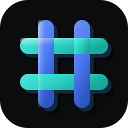
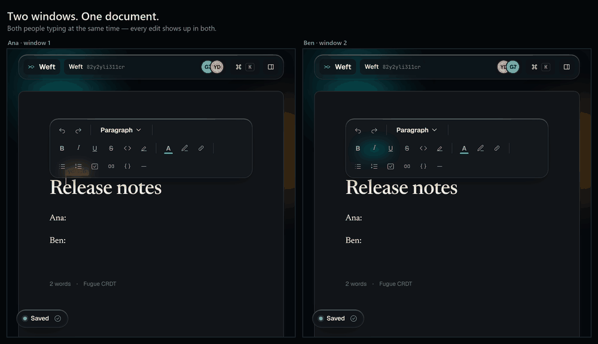
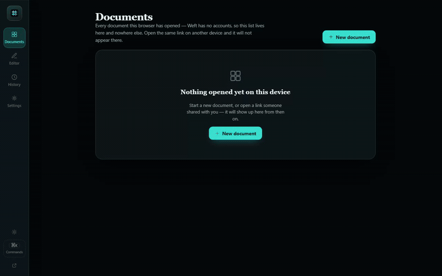
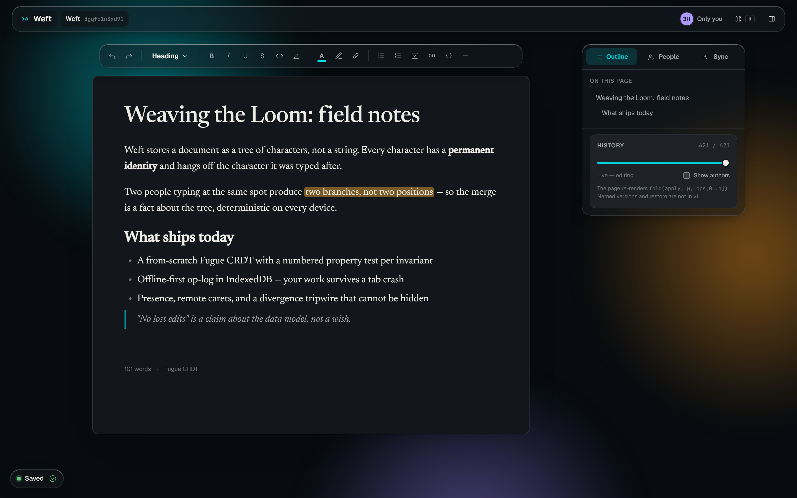
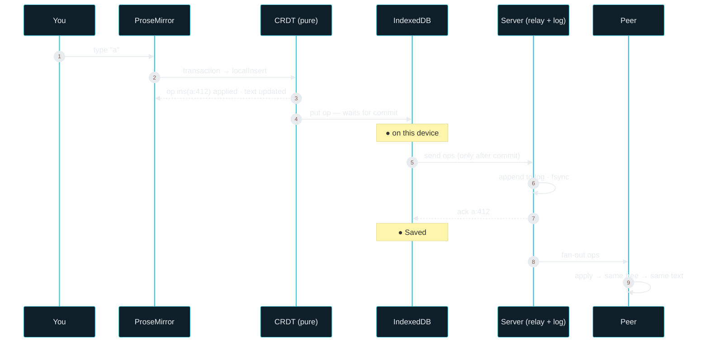
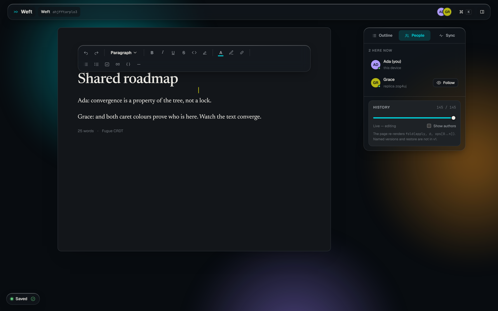
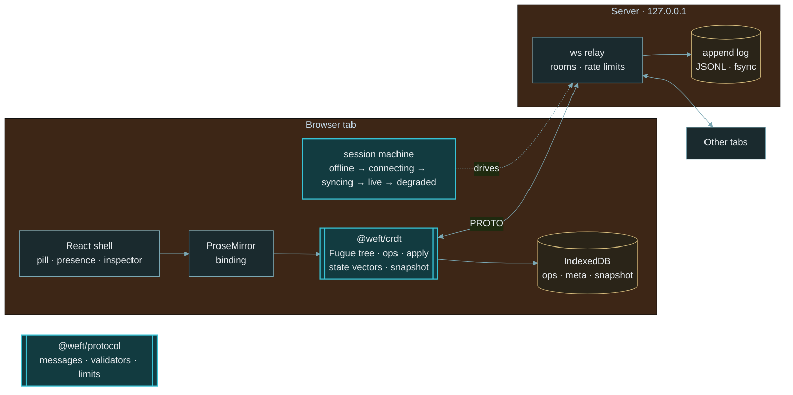

<div align="center">

<br>



# ⌗ &nbsp;W E F T

### **Two people. One document. No lost edits.**

A real-time collaborative editor built on a CRDT written from scratch —<br>
offline-first, conflict-free, and honest about exactly where your work is.

<br>

[](https://github.com/abheet19/Weft/actions/workflows/ci.yml)
[](#-where-this-project-is)
[](#-tech-stack)
[](#-install)
[](LICENSE)

<br>


<br><br>

<sub>A personal project by <b><a href="https://github.com/abheet19">Abheet</a></b>. Built to <i>learn</i> CRDTs properly, not to paste one in. Independent of any other project.</sub>

<br>

### ▶ &nbsp;[**Live demo → weft-abheet.fly.dev**](https://weft-abheet.fly.dev)

<sub><b>Try it:</b> open a document at <code>/d/&lt;any-id&gt;</code>, then open the <b>same</b> <code>/d/&lt;id&gt;</code> in a second tab and watch the two windows converge.</sub>

<br>

</div>

[](https://weft-abheet.fly.dev)

<div align="center"><sub><b>The whole product in seventeen seconds.</b> Two independent browser sessions on the same <code>/d/&lt;id&gt;</code> — both typing at once, then window&nbsp;2 is cut off the network (a real <code>setOffline</code>: <code>navigator.onLine</code> flips, the socket drops, the pill counts <code>36 changes on this device</code>) while <b>both</b> keep typing, so the two documents visibly <b>diverge</b>. On reconnect they <b>converge</b> — Weft's own <code>Back online — 36 offline edits merged.</code> strip, both pills back to <code>● Saved</code>, and <b>no "resolve conflict" dialog</b>, because a CRDT has nothing to ask. A real recording of the deployed app — reproduce it with <code>node tools/record-demo.mjs</code>.</sub></div>

<br>

[](https://weft-abheet.fly.dev)

<div align="center"><sub>A live editing pass: an <code>H1</code> title, a bold run, an <code>H2</code>, a highlight and a bulleted list applied from the persistent toolbar while the <b>Outline</b> rail fills in — ending on the honest <code>● Saved</code> pill. A real recording of the deployed app — reproduce it with <code>node tools/capture-reel.mjs</code>.</sub></div>

<br>

[](https://weft-abheet.fly.dev)

<div align="center"><sub>The persistent formatting toolbar · a live document with headings, lists and marks · the <b>Outline</b> rail · the time-travel <b>History</b> slider · the honest <code>● Saved</code> pill. A current local production-build capture — reproduce it with <code>node tools/capture-hero.mjs</code>.</sub></div>

> [!TIP]
> **Verification snapshot (10 September 2026):** [executed workflows and limits](docs/VERIFICATION.md) · [usage/release plan](docs/SANITY.md) · [deployment operations](docs/DEPLOY.md). The gate covers 613 distinct Vitest cases, a 100,000-operation benchmark, and 33 real-browser cases, including all available CTAs at desktop and 320 px, offline/reconnect, corrupt-storage recovery, and command-palette focus. The image reports its exact source SHA at `/health`; deployment is claimed only when that SHA matches the reviewed commit and the public browser smoke passes.
>
> The two README PNG stills were refreshed from the current real **local production build** and isolated data. Existing GIFs are earlier recordings, retained for the longer walkthrough; they were not re-recorded in this pass.

> [!NOTE]
> **Where this project is.** Weft is **feature-complete**: all eight build slices (S1–S8) are built,
> tested, and hardened after hostile review — the CRDT core, the sync protocol and relay, the
> ProseMirror editor binding, the offline-first store, presence and remote carets, formatting,
> history and local undo, and the ⌘K command palette (see [Gates](#-where-this-project-is)). The
> [DESIGN.md](DESIGN.md) brief argues the CRDT choice; [docs/DEMO.md](docs/DEMO.md) is the 90-second
> demo. Everything below the install line runs today. Nothing in this README states a test count that
> CI does not earn — the CI badge is the only badge that asserts a result.

---

<details open>
<summary><b>Contents</b></summary>

- [The problem](#the-problem)
- [The one hard idea](#the-one-hard-idea)
- [How a keystroke travels](#-how-a-keystroke-travels)
- [What "no lost edits" actually means](#-what-no-lost-edits-actually-means)
- [The surface](#-the-surface)
- [Architecture](#-architecture)
- [Tech stack](#-tech-stack)
- [Install](#-install)
- [Where this project is](#-where-this-project-is)
- [What it does not do yet](#-what-it-does-not-do-yet)
- [Design documents](#-design-documents)

</details>

---

## The problem

Two people edit the same paragraph at the same time. One of them is on a train and the wifi drops
for an hour. A system without an offline merge protocol can overwrite work, require a conflict decision, or
block editing until the connection returns. None of those is acceptable, and the reason they happen is not the editor — it is
that a document stored as *text* has no way to say *who typed what, next to what*.

## The one hard idea

Weft stores a document as a **tree of characters**, not a string. Every character has a permanent
identity (`who typed it` + `their counter`) and hangs off the character it was typed after. The
visible text is just a walk of that tree. Because two people typing at the same spot produce two
*branches* rather than two *positions*, the merge is a fact about the tree — deterministic on every
device — and never a decision anyone has to make.

The algorithm is **Fugue** (Weidner & Kleppmann, 2023), chosen over RGA, Logoot and Yjs's YATA
because it has one rule that fits on a whiteboard and the cleanest proof that concurrent sentences
never interleave letter-by-letter:

```
insert between LEFT and RIGHT:
  if LEFT has no right children → new item is the RIGHT child of LEFT
  else                          → new item is the LEFT  child of RIGHT
siblings on the same side sort by id.  the document = in-order traversal.
```

<div align="center"><sub>That is the whole CRDT. Everything else — convergence, causality, tombstones, offline — follows from it. The argument is in <a href="docs/01-DESIGN.md">01-DESIGN.md §1</a>.</sub></div>

## ⇄ How a keystroke travels



<div align="center"><sub>The green <b>Saved</b> pill is drawn from the <code>ack</code> in step 8 — never from the keystroke, never from a timer.</sub></div>

## ◎ What "no lost edits" actually means

The claim on the resume line is defensible only in this precise form, and Weft's UI is built to
make the three states visibly different:

| State | Pill | Where your work is |
|-------|------|--------------------|
| in memory | `● Syncing · 3` | applied on screen; IndexedDB write in progress |
| on this device | `● Offline · 31 changes on this device` | committed to IndexedDB; survives tab close and browser crash |
| saved | `● Saved` | fsync'd on the server; every peer will get it |

**What can still be lost:** the keystrokes in the milliseconds between a key press and the
IndexedDB commit if the browser process dies right then, and everything unsynced if the browser
evicts the site's storage before you are next online. Weft asks for persistent storage, shows the
answer, and always shows the count of unsynced changes. Anything stronger would be a lie —
[01-DESIGN.md §4.3](docs/01-DESIGN.md#43-what-is-lost-in-the-worst-case--the-honest-statement) says
so in more words.

## ✦ The surface

A calm, opaque writing page with a thin layer of glass chrome, designed so the *sync state* is the
most legible object on screen. "No collaborators" and "cannot reach the server" never look the same.

**Everything in the editor is a real, mergeable edit** — every control is the *same* `prosemirror-commands` command its keyboard shortcut runs, so a click and a keystroke are one op:

- **Marks** — bold, italic, underline, strikethrough, inline code, highlight, per-run **text & highlight colour**, and links (`⌘K`). Formatting is per-character last-writer-wins (the design says why).
- **Blocks** — H1–H3, bulleted / numbered / **checklist** items (ticking a box is a collaborative edit, not a local DOM flag), block quote, code block, and a divider.
- **The right rail — three tabs** — **Outline** (jump by heading, drawn live from the doc), **People** (presence: who is here, their colour, follow a peer's caret), and **Sync** (one calm status, with the per-replica state vectors + converged content hash and the chaos switches folded into **Diagnostics**).
- **Time-travel** — a **History** slider replays the document op-by-op, read-only, with an optional per-author colour wash.
- **⌘K command palette** — a real `<dialog>` with a focus trap and return-focus; the keyboard front door to theme, reduce-transparency, presence, time-travel and the same chaos switches the tests drive.
- **Local undo/redo** — this replica's own actions, emitted as real inverse ops so the mirror stays consistent (I7).

<div align="center">

**[▶ Open the interactive prototype](docs/prototype/weft.html)** — every screen and flow, clickable, no build needed

</div>

| Live | Offline | Reconnected | Diverged (tripwire) |
|------|---------|-------------|---------------------|
| named carets, `● Saved`, peers | `● Offline · N on this device`, ghost avatars | inline strip: *Back online — 12 offline edits merged* | `● Diverged — report`, both hashes shown, cannot be hidden |

[](https://weft-abheet.fly.dev)

<div align="center"><sub><b>The collaboration proof.</b> Two independent browser sessions on the same <code>/d/&lt;id&gt;</code>: the presence avatar stack, the <b>People</b> roster (<i>2 here now</i>), a peer's coloured remote caret, and both peers' text <b>converged on one page</b> — the impressive beat is the convergence, not the typing.</sub></div>

The **Sync Inspector** panel shows each replica's state vector and content hash, drawn from real
messages, so the demo's impressive moment is watching two documents *converge*, not watching
someone type. A **⌘K command palette** (a real `<dialog>` with a focus trap and return-focus) is the
keyboard front door to every control — theme, presence, time-travel, and the same chaos switches the
tests drive.

## ⌂ Architecture



<div align="center"><sub><span style="color:#38c3d6">■</span> pure (no IO, no clock, no randomness — property-testable) &nbsp;·&nbsp; <span style="color:#7aa7b3">■</span> IO &nbsp;·&nbsp; <span style="color:#d8be7e">■</span> durable storage. The server <b>never imports the CRDT</b>: it stores and relays, it cannot interpret.</sub></div>

<details>
<summary><b>Why not just use Yjs?</b></summary>

<br>

Because the point is to understand it. Yjs is what I would use at work. Weft's CRDT is worse than
Yjs in five concrete ways I can name: no run-length item merging, no compact binary encoding,
weaker tombstone GC, no ecosystem, and none of Yjs's years of performance work. Where it is not
worse: the interleaving guarantee (Fugue's is the cleanest proof available), a core you can read in
one sitting, and a numbered property test for every invariant. Full argument:
[01-DESIGN.md §1.3](docs/01-DESIGN.md#13-the-interview-question-why-not-just-use-yjs).

</details>

<details>
<summary><b>Why not OT / prosemirror-collab?</b></summary>

<br>

OT is the road not taken, and it is a good road: smaller metadata, no tombstones, and with a
central server it is simpler than any CRDT. ProseMirror's own `prosemirror-collab` is exactly that.
But offline for an hour is OT's worst case (a long rebase) and a CRDT's ordinary case, and a CRDT's
correctness is a *commutativity property* that property-based tests can hammer directly.
[01-DESIGN.md §1.2](docs/01-DESIGN.md#12-the-choice-fugue-implemented-as-an-explicit-tree).

</details>

<details>
<summary><b>What happens to a client whose clock is wrong?</b></summary>

<br>

Nothing. No part of the algorithm reads a clock: ordering is decided by the tree and by
`(replica, counter)` ids, identity by counters. Wall time is only used to display "edited 3 min
ago" and is labelled client-reported. [01-DESIGN.md §3.6](docs/01-DESIGN.md#36-failure-modes-named).

</details>

## ⚙ Tech stack

| Layer | Choice | Runtime dependency? |
|-------|--------|---------------------|
| CRDT core (`@weft/crdt`) | TypeScript, pure functions | **none** |
| Wire protocol (`@weft/protocol`) | hand-written validators, JSON v1 | **none** |
| Editor | ProseMirror (`model`, `state`, `view`, `transform`, `keymap`, `commands`) | yes — named and justified |
| Shell | React 19, Vite | yes (React) · Vite is dev-only |
| Persistence | IndexedDB (browser built-in) | none |
| Transport | WebSocket; server uses `ws` (Node 22 ships only a client) | yes (`ws`) |
| Tests | Vitest, fast-check (property tests), fake-indexeddb, jsdom | dev-only |
| CI | GitHub Actions on Windows and Ubuntu | — |

> "Zero dependencies" would be a lie. The honest sentence is: **the CRDT and protocol packages have
> zero runtime dependencies; the client needs ProseMirror and React; the server needs `ws`.**

## ⬇ Install

```powershell
cd D:\code\Weft
npm install
npm run check        # typecheck → lint → tests (incl. property tests) → coverage gates → bench → Playwright e2e
npm run dev          # server on 127.0.0.1:4200 + client on 127.0.0.1:5173 — open the same /d/<id> in two windows

# convergence proofs without a browser:
node packages\crdt\examples\two-replicas.mjs
node packages\client\examples\two-headless.mjs
```

Regenerate the README media (each drives the **live** deployment unless `WEFT_URL` says otherwise):

```powershell
node tools/record-demo.mjs   # the hero GIF - two windows, offline, merge (Playwright + Python/Pillow)
node tools/capture-reel.mjs  # the editing reel                           (Playwright + ffmpeg)
node tools/capture-hero.mjs  # the still screenshots                      (Playwright)
```

## ⌗ Where this project is

Weft is built through three approval gates. Each document is dated and re-verified against the
tree; a document that disagrees with the code is a bug.

| Gate | Document | Status |
|------|----------|--------|
| 1 · Design | [docs/01-DESIGN.md](docs/01-DESIGN.md) · [docs/03-UI.md](docs/03-UI.md) · [prototype](docs/prototype/weft.html) | **approved 2026-09-05** |
| 2 · LLD | [docs/02-LLD.md](docs/02-LLD.md) | **approved 2026-09-05** |
| 3 · Build | eight slices, riskiest first ([LLD §7](docs/02-LLD.md#7-slices)) | **S1–S8 built, tested, and hardened after hostile review — feature-complete** |

The full approval and per-slice record — what each slice built, what every hostile review found, and
how each fix was tested — is in [docs/00-GATES.md](docs/00-GATES.md). CI runs the six-gate suite
(`npm run check`) on Windows and Ubuntu; the badge at the top reflects that run.

## ∅ What it does not do yet

The deliberate limits are listed in [01-DESIGN.md §6](docs/01-DESIGN.md#6-what-i-am-not-building):
accounts or permissions · comments · images, tables, nested lists · Peritext-style formatting
semantics (formatting is per-character last-writer-wins, and the design says why) · cross-replica
(collaborative) undo — local-only undo *is* built · end-to-end encryption · horizontal server
scaling · anything that belongs to another project.

## ▤ Design documents

| Doc | What it holds |
|-----|---------------|
| [DESIGN.md](DESIGN.md) | the interview brief: the CRDT decision argued and its trade-offs, self-contained |
| [docs/DEMO.md](docs/DEMO.md) | the 90-second demo script — the impressive beat is convergence, not typing |
| [00-GATES.md](docs/00-GATES.md) | the gate process, approval record, and the verbatim build prompt for Gate 3 |
| [01-DESIGN.md](docs/01-DESIGN.md) | the CRDT decision argued, data model, sync protocol, offline story, architecture, scope, demo, risks |
| [02-LLD.md](docs/02-LLD.md) | module map, public signatures, 15 numbered invariants, state machine, wire format, test plan, slices, adversarial plan |
| [03-UI.md](docs/03-UI.md) | the "Loom glass" design language, tokens, every screen state and its exact copy |
| [prototype/weft.html](docs/prototype/weft.html) | the clickable high-fidelity prototype the build must port |
| [research/](docs/research/) | dated research briefs (editor UIs, liquid glass, CRDT literature) |

---

<div align="center">
<sub>MIT · Sources cited in <a href="docs/01-DESIGN.md#9-sources-i-will-cite-in-an-interview">01-DESIGN.md §9</a>: Fugue (Weidner &amp; Kleppmann), Interleaving anomalies (Kleppmann et al.), YATA/Yjs, RGA, Peritext, Eg-walker, Haverbeke on collaborative editing.</sub>
</div>
