# Weft — Low-Level Design (Gate 2)

**Binds to:** [01-DESIGN.md](01-DESIGN.md) and [03-UI.md](03-UI.md) (Gate 1).
**Status:** drafted 2026-09-05 · **awaiting owner approval** · no code exists yet.
**Audience:** an implementer who has never seen the design. Everything needed to build is here or
in the design; nothing here contradicts the design. Where I believe the design should change, it is
called out in §0 and **waits** — nothing was silently improved.

> Conventions. TypeScript 5.x, `"strict": true`, ESM, Node 22, npm workspaces. `PURE` = no IO, no
> clock, no randomness, no globals; every input is a parameter. Signatures below have doc comments
> that say **why**; bodies are written in Gate 3 and must not change a signature without an LLD
> extension. Paths are relative to `D:\code\Weft`.

---

## 0. Points where I would change the approved design (waiting, not done)

| # | Design says | I now think | Why | Decision needed |
|---|-------------|-------------|-----|-----------------|
| D1 | §2.1 `ReplicaId` is "random 64-bit, base32" | Keep, but fix the alphabet to **Crockford-free lowercase base32 `[a-z2-7]`, 13 chars**, so ids sort lexicographically the same in every language and are URL-safe. | Sibling order depends on string comparison; an ambiguous alphabet is a convergence bug waiting to happen. | Confirm alphabet. |
| D2 | §2.6 `fmt` op carries `targets: ItemId[]` | Carry **ranges** `{ from: ItemId, to: ItemId }[]` resolved to ids at apply time is *wrong* (ranges are not stable). Keep `targets: ItemId[]` but **cap at 4 096 ids per op** and split larger formats into several ops. | Unbounded arrays are the first thing an attacker sends. | Confirm cap. |
| D3 | §3.3 `converged { sv, hash }` from the server | The server cannot compute a content hash (it never runs the CRDT — §5.1). Change to: server sends `quiet { sv }` after 300 ms of no traffic; **clients** compute their own hash and publish it in `presence.hash`; the Inspector compares hashes it has *received*. | Keeps the server dumb, which the design wants. | Approve the rename and semantics. |
| D4 | §4.1 `snapshot` store keyed `'latest'` | Add the snapshot's own `sv` as part of the value and **write snapshot before pruning ops, in one IDB transaction**. | Otherwise a crash between "prune" and "write snapshot" loses data — exactly the failure the design promises cannot happen. | Approve (this is a strengthening). |

Everything below assumes D1–D4 are accepted. If any is rejected, the affected signatures are
marked `⟨D#⟩`.

---

## 1. Module map

```
D:\code\Weft
├─ packages
│  ├─ crdt        @weft/crdt       PURE   Fugue tree, ops, apply, traversal, state vectors, canonical bytes, snapshot codec
│  ├─ protocol    @weft/protocol   PURE   wire messages, validators, limits, error codes, JSON codec
│  ├─ client      @weft/client     IO     ProseMirror binding, IndexedDB store, session runner, presence, React UI
│  └─ server      @weft/server     IO     WebSocket relay, per-doc rooms, durable append log, limits
├─ tools          repo-local scripts (lint rules, bench runner) — dev only
├─ docs           this folder
└─ .github/workflows/ci.yml
```

Dependency direction (enforced by a lint rule in `tools/lint-deps.mjs`, gate 2 of the six):

```
client ──▶ crdt
client ──▶ protocol
server ──▶ protocol
crdt   ──▶ (nothing)
protocol ▶ (nothing)
server ─✗▶ crdt          forbidden: the server must be unable to interpret documents (design §5.1)
```

Runtime dependencies, named honestly (README repeats this list verbatim):

| Package | Runtime deps | Why each exists |
|---------|--------------|-----------------|
| `@weft/crdt` | none | The point. |
| `@weft/protocol` | none | Validators are hand-written; a schema library would be a second source of truth. |
| `@weft/client` | `prosemirror-model`, `prosemirror-state`, `prosemirror-view`, `prosemirror-transform`, `prosemirror-keymap`, `prosemirror-commands`, `react`, `react-dom` | The editor (design §5.3) and the shell. |
| `@weft/server` | `ws` | Node 22 ships a WebSocket *client*, not a server. Hand-rolling RFC 6455 framing is a rabbit hole the design does not want. |

Dev-only: `typescript`, `vitest`, `@vitest/coverage-v8`, `fast-check`, `fake-indexeddb`,
`jsdom`, `vite`, `@vitejs/plugin-react`, `eslint`, `typescript-eslint`, `@types/*`.

### 1.1 `@weft/crdt` files

| File | Responsibility |
|------|----------------|
| `src/ids.ts` | `ReplicaId`, `ItemId`, total order `compareIds`, key encoding `idKey`. |
| `src/item.ts` | `Item`, `Content`, `MarkSet`, `BlockAttrs`, the root sentinel. |
| `src/doc.ts` | `Doc` — the tree plus indexes. Constructor and read-only queries. |
| `src/ops.ts` | `Op` union and `opDependencies(op)`. |
| `src/apply.ts` | `apply(doc, op)`: the integrate rule, tombstoning, LWW, pending buffer. |
| `src/local.ts` | `localInsert`, `localDelete`, `localFormat`, `localSetBlock`: turn *intent at a visible index* into ops. |
| `src/traverse.ts` | In-order traversal, visible sequence, `PositionIndex`. |
| `src/stateVector.ts` | `StateVector`, `svOf`, `svDiff`, `svMerge`, `opsSince`. |
| `src/canonical.ts` | `canonicalBytes(doc)` — the byte string two converged replicas must share. |
| `src/snapshot.ts` | `encodeSnapshot`, `decodeSnapshot`. |
| `src/index.ts` | Public surface only. |

### 1.2 `@weft/protocol` files

`src/messages.ts` (types) · `src/limits.ts` (constants) · `src/validate.ts` (`validateMessage`,
`validateOp`) · `src/errors.ts` (codes) · `src/codec.ts` (`encode`, `decode`) · `src/version.ts`.

### 1.3 `@weft/client` files

```
src/session/machine.ts     PURE   reducer: (SessionState, SessionEvent) → { state, effects[] }
src/session/runner.ts      IO     owns the WebSocket, timers, feeds the machine, executes effects
src/store/idb.ts           IO     IndexedDB schema v1, ops/meta/snapshot stores, one-transaction rules
src/store/memoryStore.ts   PURE   same interface, in-memory (tests, and the "storage unavailable" fallback)
src/binding/schema.ts      PURE   ProseMirror schema (design §0 A1)
src/binding/positions.ts   PURE   visible index ↔ ItemId ↔ PM position; ItemAnchor resolution
src/binding/toOps.ts       PURE   PM Transaction → Op[] (local edits)
src/binding/toTransaction.ts PURE Op[] applied → minimal PM Transaction (remote edits)
src/binding/plugin.ts      IO     the ProseMirror plugin wiring the two above
src/binding/normalize.ts   PURE   CRDT sequence → schema-valid PM doc (design §5.3 "schema mismatch")
src/presence/awareness.ts  PURE   peer table, TTL expiry given a supplied `now`
src/presence/colors.ts     PURE   replica id → palette index
src/ui/*                   IO     React: Shell, Editor, StatusPill, Presence, Inspector, History, Palette, Notices
src/inspector/hash.ts      IO     crypto.subtle SHA-256 over canonicalBytes
src/main.tsx               IO     bootstrap
```

### 1.4 `@weft/server` files

`src/main.ts` (bind `127.0.0.1`) · `src/wsServer.ts` (upgrade, per-connection limits) ·
`src/room.ts` (per-doc: connections, server SV, fan-out) · `src/log/appendLog.ts` (JSONL per
doc, fsync, truncation-safe recovery) · `src/limits.ts` · `src/main.test.ts` etc.

---

## 2. Public signatures

Doc comments explain **why**. No bodies.

### 2.1 `@weft/crdt`

```ts
// ids.ts
/** 13 lowercase base32 chars [a-z2-7]. Fixed length so lexicographic order == the order every replica uses for siblings. ⟨D1⟩ */
export type ReplicaId = string & { readonly __brand: 'ReplicaId' };
export const REPLICA_ID_RE: RegExp;                        // /^[a-z2-7]{13}$/
/** Per-replica contiguous counter. Contiguity is what makes a state vector a complete description of "what I hold". */
export interface ItemId { readonly replica: ReplicaId; readonly seq: number }
/** The one total order every replica must agree on. replica (string) first, then seq (number). Used for siblings and for LWW ties. */
export function compareIds(a: ItemId, b: ItemId): -1 | 0 | 1;
/** `${replica}:${seq}` — a Map key. Exists so nobody invents a second encoding. */
export function idKey(id: ItemId): string;
export function parseIdKey(key: string): ItemId | null;

// item.ts
export type Side = 'L' | 'R';
export type MarkName = 'bold' | 'italic' | 'code' | 'link';
/** LWW register per mark. lamport is a per-replica counter *for formatting only*; ties break on replica id so convergence never depends on wall time. */
export interface MarkState { readonly active: boolean; readonly lamport: number; readonly replica: ReplicaId; readonly href?: string }
export type MarkSet = Readonly<Partial<Record<MarkName, MarkState>>>;
export type BlockType = 'paragraph' | 'heading' | 'bullet' | 'quote';
export interface BlockAttrs { readonly type: BlockType; readonly level?: 1 | 2 | 3 }
/** Content is a string, not a char, so run-length merging can arrive without changing the type (design §1.3 gap 1). v1 always stores length-1 strings. */
export type Content =
  | { readonly kind: 'char'; readonly text: string }
  | { readonly kind: 'block'; readonly attrs: BlockAttrs; readonly lamport: number; readonly replica: ReplicaId };
export interface Item {
  readonly id: ItemId;
  readonly parent: ItemId | null;   // null only for ROOT
  readonly side: Side;
  readonly content: Content;
  readonly deleted: boolean;
  readonly marks: MarkSet;
  /** Reserved for FugueMax (design §1.2). Always undefined in v1; present so the upgrade is additive. */
  readonly rightOrigin?: ItemId;
}
/** The root sentinel. Never emitted, never deleted, parent of the first insert. Its replica id is the reserved all-'a' id which REPLICA_ID_RE accepts but `newReplicaId` never generates. */
export const ROOT: Item;

// doc.ts
/** The replica's whole state. Immutable from the outside; `apply` returns a new Doc sharing structure. The pending buffer lives here so "the state after these ops" is a pure function of the ops. */
export interface Doc {
  readonly items: ReadonlyMap<string, Item>;                     // idKey → Item
  readonly children: ReadonlyMap<string, { L: readonly ItemId[]; R: readonly ItemId[] }>; // sorted by compareIds
  readonly sv: StateVector;
  readonly pending: ReadonlyMap<string, readonly Op[]>;          // missing idKey → ops waiting for it
  readonly formatLamport: number;                                // highest formatting lamport seen (for LWW)
}
export function emptyDoc(): Doc;
export function getItem(doc: Doc, id: ItemId): Item | undefined;
/** Number of ops parked because a dependency has not arrived. Surfaced in the Inspector; bounded by protocol limits. */
export function pendingCount(doc: Doc): number;

// ops.ts
export type Op =
  | { readonly t: 'ins'; readonly id: ItemId; readonly parent: ItemId; readonly side: Side; readonly content: Content }
  | { readonly t: 'del'; readonly id: ItemId; readonly target: ItemId }
  | { readonly t: 'fmt'; readonly id: ItemId; readonly targets: readonly ItemId[]; readonly mark: MarkName; readonly active: boolean; readonly lamport: number; readonly href?: string }  // ⟨D2⟩ ≤ 4096 targets
  | { readonly t: 'blk'; readonly id: ItemId; readonly target: ItemId; readonly attrs: BlockAttrs; readonly lamport: number };
/** The ids this op cannot be applied without. Explicit so causality is a data fact, not a code path. */
export function opDependencies(op: Op): readonly ItemId[];

// apply.ts
export type ApplyResult =
  | { readonly kind: 'applied'; readonly doc: Doc; readonly drained: readonly Op[] }   // drained = pending ops this one unblocked (already applied, listed for the Inspector)
  | { readonly kind: 'pending'; readonly doc: Doc; readonly missing: readonly ItemId[] }
  | { readonly kind: 'duplicate'; readonly doc: Doc }                                   // idempotence: already held
  | { readonly kind: 'rejected'; readonly doc: Doc; readonly reason: RejectReason };    // seq gap for this replica, structural impossibility
export type RejectReason = 'SEQ_GAP' | 'BAD_PARENT_SIDE' | 'TARGET_IS_ROOT' | 'SELF_PARENT';
/** THE function. Deterministic, total, idempotent. Convergence (I1) is a property of this function alone. */
export function apply(doc: Doc, op: Op): ApplyResult;
/** apply in sequence; exists so tests and time-travel share one implementation. */
export function applyAll(doc: Doc, ops: readonly Op[]): { doc: Doc; results: readonly ApplyResult[] };

// local.ts
/** Turns "insert text at visible index i" into ops using the Fugue rule. Needs the replica id and its next seq — supplied, never generated here (purity). */
export function localInsert(doc: Doc, me: ReplicaId, nextSeq: number, visibleIndex: number, content: Content): { ops: readonly Op[]; doc: Doc };
export function localDelete(doc: Doc, me: ReplicaId, nextSeq: number, visibleFrom: number, visibleTo: number): { ops: readonly Op[]; doc: Doc };
export function localFormat(doc: Doc, me: ReplicaId, nextSeq: number, visibleFrom: number, visibleTo: number, mark: MarkName, active: boolean, href?: string): { ops: readonly Op[]; doc: Doc };
export function localSetBlock(doc: Doc, me: ReplicaId, nextSeq: number, visibleIndexInBlock: number, attrs: BlockAttrs): { ops: readonly Op[]; doc: Doc };

// traverse.ts
/** The visible sequence in document order. O(n). Tests and canonicalBytes use it; the editor uses PositionIndex instead. */
export function visibleItems(doc: Doc): readonly Item[];
/** Incremental index: visible offset ↔ ItemId, and block boundaries. Rebuilt lazily; the binding's hot path. */
export interface PositionIndex {
  readonly length: number;
  idAt(visibleIndex: number): ItemId | null;         // null at end
  indexOf(id: ItemId): number | -1;                  // -1 if deleted or unknown
  blockRanges(): readonly { from: number; to: number; boundary: ItemId; attrs: BlockAttrs }[];
}
export function buildIndex(doc: Doc): PositionIndex;
/** For the Fugue rule: the next item in traversal order INCLUDING tombstones (design §2.3). */
export function nextInTraversal(doc: Doc, id: ItemId): ItemId | null;

// stateVector.ts
export type StateVector = Readonly<Record<ReplicaId, number>>;
/** ops that `mine` holds and `theirs` lacks, in per-replica seq order. This is the catch-up payload; it is why the whole doc is never re-sent. */
export function opsSince(mine: Doc, theirs: StateVector, log: OpLog): readonly Op[];
export function svDiff(mine: StateVector, theirs: StateVector): { iHave: StateVector; theyHave: StateVector };
export function svEqual(a: StateVector, b: StateVector): boolean;
/** Read-only view over persisted ops keyed by replica; supplied by the store so crdt stays pure. */
export interface OpLog { get(replica: ReplicaId, fromSeq: number, toSeq: number): readonly Op[] }

// canonical.ts
/** The bytes two converged replicas must share: visible chars, active marks, block attrs — as a JSON *array* (never an object, so no key can be silently dropped; see Zeno's __proto__ lesson). Deterministic. */
export function canonicalBytes(doc: Doc): Uint8Array;

// snapshot.ts
/** Serialised tree with tombstone text stripped, plus the SV it represents. Decoding yields a Doc with identical canonicalBytes and sv (I12). */
export interface Snapshot { readonly v: 1; readonly sv: StateVector; readonly items: readonly SnapshotItem[] }
export function encodeSnapshot(doc: Doc): Snapshot;
export function decodeSnapshot(s: Snapshot): Doc;
```

### 2.2 `@weft/protocol`

```ts
// limits.ts — every number an attacker will probe, in one place
export const LIMITS = {
  PROTO_VERSIONS: [1] as const,
  MAX_MESSAGE_BYTES: 262_144,        // 256 KiB — a paste is ~ thousands of ops; a snapshot request is separate
  MAX_OPS_PER_MESSAGE: 512,
  MAX_FMT_TARGETS: 4_096,            // ⟨D2⟩
  MAX_CHAR_LEN: 1,                   // v1: one code point per item (a surrogate pair is one string of length 2 — see validate)
  MAX_PRESENCE_NAME: 40,
  MAX_PENDING_PER_REPLICA: 10_000,   // parked ops before the client drops the connection and re-hellos
  RATE_OPS_PER_SEC: 2_000,
  RATE_MESSAGES_PER_SEC: 60,
  QUIET_MS: 300,                     // ⟨D3⟩ server sends `quiet` after this silence
  PRESENCE_TTL_MS: 30_000,
} as const;

// messages.ts
export type ClientMessage =
  | { v: 1; t: 'hello'; doc: string; replica: ReplicaId; sv: StateVector }
  | { v: 1; t: 'ops'; ops: Op[] }
  | { v: 1; t: 'presence'; state: PresenceState | null }        // null = leaving
  | { v: 1; t: 'ping' };
export type ServerMessage =
  | { v: 1; t: 'welcome'; sv: StateVector; snapshot?: Snapshot }  // snapshot only if client sv is empty and log length > SNAPSHOT_THRESHOLD
  | { v: 1; t: 'ops'; ops: Op[] }
  | { v: 1; t: 'ack'; replica: ReplicaId; seq: number }           // THE source of "Saved" (I11); sent after fsync (I10)
  | { v: 1; t: 'presence'; replica: ReplicaId; state: PresenceState | null }
  | { v: 1; t: 'quiet'; sv: StateVector }                         // ⟨D3⟩
  | { v: 1; t: 'error'; code: ErrorCode; reason: string; fatal: boolean; supported?: number[] }
  | { v: 1; t: 'pong' };
export interface PresenceState { name: string; color: number; cursor?: { anchor: ItemAnchor; head: ItemAnchor }; hash?: string }
/** A position that survives concurrent edits: the item it sits after (or before, at index 0). */
export interface ItemAnchor { id: ItemId | null; side: 'before' | 'after' }

// errors.ts
export type ErrorCode = 'BAD_SHAPE' | 'UNSUPPORTED_VERSION' | 'SEQ_GAP' | 'FOREIGN_REPLICA' | 'TOO_LARGE' | 'RATE_LIMITED' | 'PENDING_OVERFLOW' | 'INTERNAL';

// validate.ts
export type Valid<T> = { ok: true; value: T } | { ok: false; code: ErrorCode; reason: string };
/** Structural validation of an untrusted decoded JSON value. Never throws. Rejects unknown top-level fields (a v2 field on a v1 message is a shape error, not a feature). */
export function validateClientMessage(x: unknown): Valid<ClientMessage>;
export function validateServerMessage(x: unknown): Valid<ServerMessage>;
export function validateOp(x: unknown): Valid<Op>;

// codec.ts
/** decode = size check (bytes, before parsing) → JSON.parse in try → validate. Exists so nobody calls JSON.parse on the wire directly. */
export function decodeClient(bytes: string | Uint8Array): Valid<ClientMessage>;
export function decodeServer(bytes: string | Uint8Array): Valid<ServerMessage>;
export function encode(m: ClientMessage | ServerMessage): string;

// version.ts
/** A v1 client meeting a v2 server: server answers in the highest version both support; if none, `error UNSUPPORTED_VERSION fatal supported:[…]` and close 1002. */
export function negotiate(clientVersion: number, serverVersions: readonly number[]): number | null;
```

### 2.3 `@weft/client`

```ts
// session/machine.ts  — PURE reducer. The UI reads `state`; the runner executes `effects`.
export type SessionState =
  | { s: 'offline';    reason: 'user' | 'browser'; unacked: number }
  | { s: 'connecting'; attempt: number; unacked: number }
  | { s: 'syncing';    inbound: number; outbound: number; unacked: number }
  | { s: 'live';       unacked: number; lastAckAt: number | null }
  | { s: 'degraded';   attempt: number; retryAt: number; lastError: string; unacked: number };
export type SessionEvent =
  | { e: 'START' } | { e: 'USER_OFFLINE' } | { e: 'USER_ONLINE' } | { e: 'BROWSER_OFFLINE' } | { e: 'BROWSER_ONLINE' }
  | { e: 'SOCKET_OPEN' } | { e: 'SOCKET_CLOSED'; code: number; reason: string } | { e: 'SOCKET_ERROR'; reason: string }
  | { e: 'WELCOME'; theirSv: StateVector; mySv: StateVector } | { e: 'CATCHUP_DONE' }
  | { e: 'LOCAL_OPS_PERSISTED'; count: number } | { e: 'ACK'; upToSeq: number; mySeq: number }
  | { e: 'SERVER_ERROR'; code: ErrorCode; fatal: boolean; reason: string } | { e: 'TIMER'; now: number };
export type Effect =
  | { f: 'OPEN_SOCKET' } | { f: 'CLOSE_SOCKET'; code: number } | { f: 'SEND_HELLO' } | { f: 'SEND_OPS_SINCE'; sv: StateVector }
  | { f: 'SCHEDULE'; at: number } | { f: 'REHELLO' };
/** Backoff is a pure function of attempt so tests can assert it: min(250 * 2^attempt, 8000) ms, plus supplied jitter in [0, 250). */
export function backoffMs(attempt: number, jitter: number): number;
export function reduce(state: SessionState, ev: SessionEvent, now: number): { state: SessionState; effects: readonly Effect[] };
export const initialSession: SessionState;

// store/idb.ts
export interface Store {
  /** Persist ops and resolve only after the IDB transaction's `complete` event. Callers MUST NOT send before this resolves (I10). */
  putOps(ops: readonly Op[]): Promise<void>;
  markAcked(sv: StateVector): Promise<void>;
  unacked(): Promise<readonly Op[]>;
  load(): Promise<{ doc: Doc; me: ReplicaId; acked: StateVector } | null>;
  /** Snapshot + prune in ONE transaction ⟨D4⟩. */
  compact(doc: Doc): Promise<void>;
  opLog(): OpLog;
  persisted(): Promise<boolean>;             // navigator.storage.persist() result, surfaced in the pill
}
export function openIdbStore(docId: string, opts?: { durability?: 'default' | 'strict' }): Promise<Store>;
export function memoryStore(): Store;         // tests and the "IndexedDB unavailable" fallback (UI must say so)

// binding/positions.ts
/** PM positions count node boundaries; visible indexes count items. This is the only place that knows the offset formula. */
export function pmPosToVisible(doc: PMNode, pos: number): number;
export function visibleToPmPos(doc: PMNode, index: number): number;
export function anchorFromVisible(index: PositionIndex, visible: number): ItemAnchor;
export function visibleFromAnchor(index: PositionIndex, a: ItemAnchor): number;   // clamps to a live neighbour if the anchor item is deleted

// binding/toOps.ts
/** For each ReplaceStep / AddMarkStep / RemoveMarkStep / SetBlockType in a local transaction, produce ops via local.ts. Pure given doc, index and the next seq. */
export function transactionToOps(doc: Doc, index: PositionIndex, me: ReplicaId, nextSeq: number, tr: Transaction): { ops: readonly Op[]; doc: Doc };

// binding/toTransaction.ts
/** Given the doc before and after remote ops, build the minimal PM transaction and tag it `weft-remote` so plugin.ts does not loop it back. */
export function opsToTransaction(before: Doc, after: Doc, state: EditorState): Transaction;

// binding/normalize.ts
/** The CRDT can express what the PM schema forbids (empty doc, heading level on a bullet). Map every such sequence to one schema-valid doc, deterministically, without emitting ops. */
export function normalize(items: readonly Item[]): PMNode;

// presence/awareness.ts  (PURE, `now` supplied)
export function upsertPeer(table: PeerTable, replica: ReplicaId, state: PresenceState | null, now: number): PeerTable;
export function expirePeers(table: PeerTable, now: number, ttlMs: number): PeerTable;
```

### 2.4 `@weft/server`

```ts
// log/appendLog.ts
/** One JSONL file per doc: one op per line, fsync per batch. Recovery tolerates a torn last line (truncate to last newline, log it). The server's SV is derived from the file, never trusted from memory after restart. */
export interface AppendLog {
  append(ops: readonly Op[]): Promise<void>;     // resolves after fsync — the ack is sent only after this
  sv(): StateVector;
  read(theirs: StateVector): readonly Op[];      // catch-up payload
  length(): number;
}
export function openAppendLog(path: string): Promise<AppendLog>;

// room.ts
/** All connections to one doc. Enforces per-replica seq contiguity (I9) and that a connection only sends ops for the replica it said hello as (FOREIGN_REPLICA). */
export class Room { join(conn: Conn, hello: HelloMsg): void; onOps(conn: Conn, ops: Op[]): Promise<void>; leave(conn: Conn): void }

// wsServer.ts
export interface ServerOptions { host: '127.0.0.1'; port: number; dataDir: string; limits?: Partial<typeof LIMITS> }
export function startServer(o: ServerOptions): Promise<{ close(): Promise<void>; port: number }>;
```

---

## 3. Invariants (each gets a numbered property test in Gate 3)

| # | Invariant | Formal-ish statement | Test (§6) |
|---|-----------|----------------------|-----------|
| **I1** | **Convergence** | For any two docs `A`, `B` built from op sets `SA`, `SB`: `svEqual(A.sv, B.sv) ∧ A.pending = ∅ ∧ B.pending = ∅ ⇒ canonicalBytes(A) = canonicalBytes(B)`. | `crdt/convergence.prop` |
| **I2** | **Order-independence** | For any op set `S` and any two permutations `p`, `q`: `applyAll(∅, p(S)).doc ≡ applyAll(∅, q(S)).doc` (≡ on canonicalBytes and sv). | `crdt/permutation.prop` |
| **I3** | **Idempotence** | `apply(apply(D, o).doc, o).kind = 'duplicate'` and the doc is unchanged. | `crdt/idempotence.prop` |
| **I4** | **Causality** | `apply(D, o)` is `'applied'` only if every `opDependencies(o)` is in `D.items`; otherwise `'pending'`, and the op is applied automatically when the last dependency lands. Nothing is dropped. | `crdt/causality.prop` |
| **I5** | **No lost insert** | Every `ins` applied and not targeted by an applied `del` appears exactly once in `visibleItems`. | `crdt/noLoss.prop` |
| **I6** | **No resurrection** | Once `del(x)` is applied on a replica, `x` never appears in that replica's `visibleItems` again, regardless of later ops. | `crdt/noResurrect.prop` |
| **I7** | **Editor mirror** | After every PM transaction (local or remote), `textOf(editorState.doc) = textOf(visibleItems(doc))` and block structure matches `normalize`. Dev-mode assertion + test. | `client/binding/mirror.prop` |
| **I8** | **Forward non-interleaving** | Two replicas concurrently insert runs `r1`, `r2` at the same visible index; after merge each run is contiguous. | `crdt/interleave.prop` |
| **I9** | **Seq contiguity** | The server accepts op `(r, n)` only if its SV has `r ↦ n−1`; the client applies the same rule to inbound live ops. Violations → `SEQ_GAP`. | `server/room.test` denied path |
| **I10** | **Durability before send / ack** | Client: `ws.send` for op `o` happens-after `putOps([o])` resolved. Server: `ack(seq)` happens-after `append` resolved (fsync). | `client/session/order.test`, `server/log.test` interrupted path |
| **I11** | **Saved is derived** | Pill shows `Saved` iff `state.s = 'live' ∧ unacked = 0`, and `unacked` is computed from persisted ops minus acked SV — never from a UI event. | `client/ui/pill.test` |
| **I12** | **Snapshot equivalence** | `decodeSnapshot(encodeSnapshot(D)) ≡ D` on canonicalBytes and sv, for any D. | `crdt/snapshot.prop` |
| **I13** | **Tripwire visibility** | If two received `presence.hash` values differ while the SVs are equal, the UI enters `Diverged` and cannot be dismissed without an explicit action. | `client/inspector.test` |
| **I14** | **Server ignorance** | `@weft/server` has no import path to `@weft/crdt`. | `tools/lint-deps` (build fails) |
| **I15** | **Total validation** | `decodeClient(x)` never throws for any `x`, and every non-`ok` result carries a code the sender can act on. | `protocol/fuzz.prop` |

**The ONE test that fails if the CRDT is subtly wrong:** `crdt/convergence.prop` in its
*partitioned-network* form — 3–4 replicas, random local ops (chars *and* block boundaries, deletes,
formats), a random partition/heal schedule, per-message random delivery order, duplicates and
drops, then assert I1, I2 (against a fresh replay of the merged log), I3 and I12 together. A wrong
sibling order, a wrong `rightOrigin` choice (visible-vs-tombstone), a `del` racing an `ins`, or a
pending-buffer leak all surface here and shrink to a handful of ops. Runs 10 000 cases in CI with a
fixed seed and 1 000 with a fresh seed.

---

## 4. Client session state machine

```mermaid
stateDiagram-v2
  [*] --> offline: load (browser offline or user toggle persisted)
  [*] --> connecting: load
  connecting --> syncing: SOCKET_OPEN → SEND_HELLO ; WELCOME
  connecting --> degraded: SOCKET_CLOSED / SOCKET_ERROR / hello timeout 5 s
  syncing --> live: CATCHUP_DONE (all diff ops applied, pending = ∅)
  syncing --> degraded: SOCKET_CLOSED / SERVER_ERROR(non-fatal)
  live --> degraded: SOCKET_CLOSED / SOCKET_ERROR / ping timeout 10 s
  live --> syncing: SERVER_ERROR(SEQ_GAP) → REHELLO
  degraded --> connecting: TIMER at retryAt
  degraded --> offline: BROWSER_OFFLINE
  live --> offline: USER_OFFLINE / BROWSER_OFFLINE  (CLOSE_SOCKET 1000)
  syncing --> offline: USER_OFFLINE / BROWSER_OFFLINE
  connecting --> offline: USER_OFFLINE / BROWSER_OFFLINE
  offline --> connecting: USER_ONLINE / BROWSER_ONLINE
  live --> [*]: SERVER_ERROR(fatal) → show error card, stay offline-editable
```



| State | What the user sees (03-UI §4.1) | Editing? | Ops go to |
|-------|----------------------------------|----------|-----------|
| `offline` | `● Offline · N changes on this device` (amber) | yes | IndexedDB only |
| `connecting` | `● Connecting…` (amber) + attempt | yes | IndexedDB; queued |
| `syncing` | `● Catching up · N in, M out` (blue) | yes | IndexedDB; sent after catch-up |
| `live` | `● Saved` (green) or `● Syncing · N` (blue) | yes | IndexedDB → socket |
| `degraded` | `● Reconnecting in Ns · N on this device` (amber) + last error + **Retry now** | yes | IndexedDB only |

Editing is never disabled. Every state shows the unacked count except `live` with 0, so **the user can
always tell whether their work is safe**: green = on server; blue = in flight; amber = on this
device only.

Timers: hello timeout 5 s; ping every 15 s, pong timeout 10 s; backoff `min(250·2^attempt, 8000)` +
jitter; `attempt` resets on `live`. `TIMER` events carry `now` so the reducer stays pure.

---

## 5. Wire format

### 5.1 Envelope

Every frame is one UTF-8 JSON text message: `{ "v": 1, "t": "<type>", ...fields }`. Binary frames
are rejected in v1 (`BAD_SHAPE`, non-fatal, counted). Max frame `LIMITS.MAX_MESSAGE_BYTES`, checked
on byte length **before** `JSON.parse`.

### 5.2 Schemas (field · type · constraints)

```
hello      doc: string /^[a-z0-9-]{8,64}$/ · replica: ReplicaId · sv: {ReplicaId: uint} (≤ 1 000 keys)
welcome    sv · snapshot?: Snapshot (only when hello.sv = {} and log.length > 5 000)
ops        ops: Op[] (1..512) — each Op per validateOp: ids well-formed; ins.content.char length 1 code point (a surrogate pair is allowed as a 2-char string, nothing longer); fmt.targets 1..4096; blk/level ∈ {1,2,3} only when type = heading
ack        replica · seq: uint
presence   state: { name: string (1..40, no control chars) · color: 0..7 · cursor?: {anchor, head} · hash?: /^[0-9a-f]{64}$/ } | null
quiet      sv
error      code: ErrorCode · reason: string (≤ 200) · fatal: boolean · supported?: uint[]
ping/pong  —
```

Unknown `t` on the **client** side: ignored and counted (forward compatibility). Unknown `t` on
the **server** side: `BAD_SHAPE` non-fatal; 10 such in a minute → `RATE_LIMITED` fatal, close 1008.

### 5.3 Versioning

- `v` is required on every frame. `hello.v` is the client's *maximum*; the server picks
  `negotiate(v, PROTO_VERSIONS)` and answers `welcome` in that version. A v2 server keeps a v1
  encoder as long as v1 is in `PROTO_VERSIONS`.
- If `negotiate` returns `null`: `error { code: UNSUPPORTED_VERSION, fatal: true, supported: [...] }`
  then close **1002**. The client shows the error card with the supported list and stays
  offline-editable — a version mismatch never loses work.
- A v2 *client* meeting a v1 server sends `hello v:2`; server replies `UNSUPPORTED_VERSION`
  `supported:[1]`; client downgrades and re-hellos with `v:1` once (no loop).

### 5.4 Rejections and how the sender learns

| Situation | Code | fatal | Close | Client action |
|-----------|------|-------|-------|---------------|
| Unparseable / wrong shape | `BAD_SHAPE` | no | — | count; if it was *our* op batch, re-validate and re-hello |
| `hello` version unsupported | `UNSUPPORTED_VERSION` | yes | 1002 | error card, stay offline |
| op seq ≠ known+1 | `SEQ_GAP` | no | — | `REHELLO` (state vector exchange repairs) |
| op.id.replica ≠ hello.replica | `FOREIGN_REPLICA` | yes | 1008 | error card ("this tab's identity is corrupt"), offer *Start fresh* |
| frame > limit | `TOO_LARGE` | no | — | split the batch (client caps at 512 anyway) |
| rate exceeded | `RATE_LIMITED` | yes after 3 warnings | 1008 | backoff as `degraded` |
| server pending overflow (client sent > 10 000 unresolvable ops) | `PENDING_OVERFLOW` | yes | 1008 | error card |
| server exception | `INTERNAL` | yes | 1011 | `degraded` |

---

## 6. Test plan

Runner: Vitest. Coverage gate (build **fails** below): `crdt` 95 % lines / 90 % branches;
`protocol` 95/90; `client` 85/75 (React shells excluded by file glob, binding and session included
at 90/80); `server` 90/80. Property tests via fast-check with `numRuns` 10 000 (crdt) and 1 000
(others) in CI; seeds printed on failure and committed as regression examples.

### 6.1 Generators

```ts
arbReplica      : fc.constantFrom('a…', 'b…', 'c…', 'd…')              // 4 fixed ids, lexicographically distinct
arbContent      : 80 % char (from alphabet 'abcd ▮' where ▮ = block boundary, plus one astral char '𝄞'), 20 % block
arbLocalIntent  : insert at random visible index | delete random range | format random range | setBlock
arbScript       : per replica, 0..40 intents, generated *against that replica's evolving doc* (so indexes are valid)
arbSchedule     : sequence of { partition: Set<Set<Replica>>, rounds: n } segments ending fully healed
arbDelivery     : for each message: order permutation, dup ∈ {0,1,2}, drop with p=0.1 (re-delivered on heal)
arbPermutation  : fc.shuffledSubarray over a fixed op set (I2)
arbBytes        : fc.uint8Array / fc.string / fc.jsonValue for I15
```

### 6.2 Per module

| Module | Invariant / property | Denied path | Interrupted path |
|--------|----------------------|-------------|------------------|
| `crdt/apply` | I1–I6, I8, I12 (above) + example tests from design §2.7 (`Hi there!`/`Hi!`) and the Fugue paper's Fig. 4 | `apply` of `SEQ_GAP`, `TARGET_IS_ROOT`, `SELF_PARENT`, parent on wrong side → `rejected`, doc unchanged | `applyAll` of a prefix then the rest ≡ all at once (resume after crash) |
| `crdt/local` | round-trip: `localInsert` at i then `visibleItems`[i] is the text | insert at index > length → throws `RangeError` (programmer error, not data) | — |
| `crdt/traverse` | `buildIndex` agrees with `visibleItems` for all docs (property) | — | incremental rebuild after each op equals fresh build |
| `crdt/canonical` | deterministic; two structurally different `Map` insertion orders give equal bytes; `__proto__` as a mark name is impossible by type but a runtime key `"__proto__"` in a decoded snapshot is rejected | — | — |
| `protocol/validate` | I15 fuzz: never throws; accepts every message `encode` produces (round trip) | each limit boundary ±1; unknown field; `v: 2`; binary frame | truncated JSON |
| `client/session` | model-based (`fc.commands`) over events: never leaves `offline` on socket events; `unacked` never negative; backoff formula | fatal error → error state, editing still allowed | `SOCKET_CLOSED` mid-`syncing` → `degraded` → `connecting` resumes with same SV |
| `client/store` (fake-indexeddb) | `load` after `putOps` returns every op; `compact` then `load` ≡ before | IDB `open` throws → `memoryStore` fallback and the UI flag `storage: 'memory'` | abort the transaction between snapshot and prune → nothing lost (D4) |
| `client/binding` | I7 property: random PM transactions (typing, deleting, Enter, Backspace at start) then random remote ops | remote op producing schema-invalid doc → `normalize` result is valid | remote op arrives while a local transaction is being built → both applied, I7 holds |
| `client/presence` | peers expire at exactly `ttl`; colour stable for a replica id | name > 40 chars rejected before send | disconnect clears peers to "unknown", not empty |
| `server/log` | `read(sv)` returns exactly the diff; recovery after torn last line keeps all complete lines | append of op with seq gap → refused | kill after write before fsync (simulated with an injectable fs) → on reopen, SV = last fsync'd |
| `server/room` | two headless Node clients over a real socket converge (I1 end-to-end); three clients with one partitioned | `FOREIGN_REPLICA`; `SEQ_GAP`; rate limit; oversize frame | server restart mid-session: clients re-hello and converge |
| `tools/lint-deps` | fails on a synthetic `server → crdt` import | — | — |

### 6.3 End-to-end (Playwright is **not** added; use Vitest + jsdom + two client instances over a real `ws` server in-process)

One test: two clients, one goes `USER_OFFLINE`, both type at the same index, reconnect, assert
I1 and I8 on both editors' text, and that the pill of the offline client read `Offline · N` with
`N` equal to the ops it generated.

### 6.4 Benchmarks (not tests; a `tools/bench.mjs` with a budget that fails CI if exceeded 2×)

100 000 ops (80 % insert, 20 % delete, from a 3-replica random script): full replay < 1.5 s;
`buildIndex` < 150 ms; snapshot encode+decode < 300 ms; peak heap < 200 MB. Numbers are budgets
for a laptop-class machine and are printed, not hard-coded into any doc or badge.

---

## 7. Slices

Order: riskiest unknown first. Each slice ends green on all six gates and is demoable alone.
Hours are estimates at 8–10 h/week.

| # | Slice | Delivers | Proves | Est. |
|---|-------|----------|--------|------|
| **S1** | **CRDT core** | `@weft/crdt` complete: ids, tree, apply, local, traverse, SV, canonical, snapshot. A 40-line Node script that runs two in-memory replicas through the design's §2.7 example and prints both traversals. | I1–I6, I8, I12 under 10 000 partitioned runs. Bench budget. **If this fails, stop and fix before anything else exists.** | 18–22 h (2–2.5 wk) |
| **S2** | **Protocol + relay + durable log** | `@weft/protocol`, `@weft/server`, and a *headless* client (`client/session` + `memoryStore`, no UI) that speaks the protocol from Node. `npm run dev:server`. | I9, I10 (server side), I14, I15; two headless replicas converge over a real socket; server restart recovery; every §5.4 rejection. | 12–15 h (1.5 wk) |
| **S3** | **ProseMirror binding** | `client/binding/*`, a minimal Vite + React shell showing one editor bound to a local Doc and the S2 session. Plain paragraphs and boundaries only (no marks yet). Two tabs converge. | I7 property; the R1 risk is retired or exposed here. | 16–20 h (2 wk) |
| **S4** | **Offline-first** | `client/store/idb.ts`, full session machine wired, **status pill with all states** (03-UI §4.1), *Simulate offline* toggle, `navigator.storage.persist()` surfaced, reconnect inline strip. | I10 (client side), I11; the tab-kill interrupted test; the design's §4.3 worst-case statement is verified by observation and written into the README. **The resume line is true after S4.** | 12–15 h (1.5 wk) |
| **S5** | **Presence + Inspector** | Awareness channel, remote carets and selections on item anchors, avatar stack with `Only you` / `Peers unknown`, **Sync Inspector** with lanes, SV chips, hash footer, chaos controls (drop/delay). | I13 tripwire; the 90-second demo runs end to end. | 8–10 h (1 wk) |
| **S6** | **Formatting** | Marks (`fmt`), block types (`blk`), floating format bar, keyboard shortcuts, `normalize` for every schema mismatch. | I1–I6 re-run with marks/blocks in the alphabet (they already are; now the UI exercises them). The §2.5 anomaly is demonstrated deliberately in a test named after it. | 12–15 h (1.5 wk) |
| **S7** | **History** | Time-travel slider (`applyAll` prefix), IDB compaction on 500 ops (D4), **local-only undo** via an inverse-op stack filtered to `me`. | I12 in the wild; undo never touches a peer's items (property). | 10–12 h (1.5 wk) |
| **S8** | **Portfolio surface** | GitHub Actions CI running all six gates, README (per 00-GATES §README), DESIGN.md polished from 01-DESIGN, demo script rehearsed and timed. | The CI badge is real; no number in any doc is hand-written. | 4–6 h (0.5 wk) |

Total ≈ 92–115 h ≈ 11–13 weeks at this cadence. **S1–S4 (≈ 60 h, 7–8 weeks) are the
defensible artefact**; if interviews compress the calendar, stop after S4 or S5 and the README's
"what this does not do yet" grows — it does not lie.

Slice exit ritual (from §3 of the build prompt): show what was built, each test and what it
proves, what was attacked and what broke, what was deliberately not done, and the exact PowerShell
commands to verify. Then stop.

---

## 8. Adversarial plan (becomes the attack pass of each slice)

| Slice | Attack | Expected defence | If it breaks |
|-------|--------|------------------|--------------|
| S1 | Op whose `parent` is itself; `parent` is a tombstone (legal!); `parent` on side `L` of ROOT; `del` of ROOT; `ins` with `seq` 0 or 2⁵³ | `rejected` with reason, doc unchanged; tombstone parent **accepted** (that is correct) | I1 breaks silently → the partitioned test must catch it; add the case as a fixed example |
| S1 | 100 000 ops, then 100 000 deletes, then 1 insert at index 0 | `buildIndex` and `apply` within bench budget; memory bounded | traversal is O(n) per keystroke → incremental index is mandatory, not optional |
| S1 | Two replicas with ids differing only in the last char; concurrent inserts everywhere | ordering deterministic (I2) | `compareIds` uses locale compare → replace with code-point compare |
| S1 | A snapshot JSON with `"__proto__"` / `"constructor"` keys, or a mark name not in `MarkName` | `decodeSnapshot` rejects; canonical uses arrays | prototype pollution → the Zeno bug, again |
| S2 | 10 MB frame; 513 ops; op array containing a string; `hello` twice; `ops` before `hello`; `v: 1.0`, `v: "1"`, `v: -1` | `TOO_LARGE`/`BAD_SHAPE` before any allocation beyond the frame; `ops` before `hello` → `BAD_SHAPE` fatal | a `JSON.parse` on an unchecked body → the size check moved |
| S2 | Replay: resend my own ops 1..400 after they were acked | `duplicate` server-side (SV says known), no re-fan-out, no double ack | log grows with duplicates → append must check SV first |
| S2 | Forge: connection A sends ops with replica B's id | `FOREIGN_REPLICA` fatal | — |
| S2 | Future seq: `seq` = known + 1 000 | `SEQ_GAP`; nothing stored | server "helpfully" fills gaps → never |
| S2 | Kill server process after `write` before `fsync` (fault-injected fs) | on restart, torn line truncated, SV = fsync'd prefix, clients re-upload | ack was sent before fsync → I10 broken, fix ordering |
| S2 | 500 connections to one doc; 2 000 ops/s from one | rate limit 1008 after warnings; other connections unaffected | one hot connection starves fan-out → per-connection send queues with a cap |
| S3 | Paste 50 000 characters; paste rich HTML (tables); drag-and-drop text | chunked into ≤ 512-op messages; tables normalised to paragraphs; drop disabled | schema exception → `normalize` missing a case |
| S3 | Remote op deletes the block boundary the local cursor is in while typing | cursor anchor clamps (visibleFromAnchor); I7 holds | cursor jumps to 0 → anchor resolution bug |
| S3 | Composition (IME) input mid-remote-update | PM composition handling respected: remote transaction deferred until `compositionend` | garbled CJK input → defer queue missing |
| S4 | Kill the tab 5 ms after a keystroke, 1 000 times (scripted with jsdom + fake-indexeddb abort) | at most the in-flight transaction's ops lost; never an acked op; never a *committed* op | committed op lost → `putOps` resolved before `complete` |
| S4 | IndexedDB throws on open (private mode / quota) | `memoryStore` + pill suffix `· not persisted on this device` (never silent) | — |
| S4 | Two tabs, same doc, same origin, same `me` in `meta` | second tab **must** mint a new replica id (seq collision otherwise) — `meta.me` is per tab via `sessionStorage` lock or a `BroadcastChannel` claim | two tabs share a replica → `SEQ_GAP` storms; design the claim in S4 LLD extension |
| S4 | Clock set to 1970 / 2099 on one client | nothing changes: no wall time in the algorithm; "edited N ago" shows "client-reported" | any ordering uses `Date.now()` → remove |
| S5 | Presence `name` of 10 000 chars; `color: 99`; cursor anchor to a non-existent id; 1 000 presence/s | validator rejects; anchor to unknown id → not rendered, counted; presence rate limited separately from ops | XSS via name → name is text node only, never HTML |
| S5 | Peer publishes a fake `hash` that differs | Inspector shows `hashes differ` **for that peer**, marks it, does not alter the doc | a peer can DoS the UI into `Diverged` → tripwire is per-peer and requires equal SV; make the copy say which peer |
| S6 | `fmt` with 4 096 targets × 512 ops per message; `blk` with `level: 3` on `type: bullet`; `href: "javascript:..."` | limits; validator rejects level on non-heading; hrefs allowlisted to `http(s):`/`mailto:` at render *and* at validate | — |
| S7 | Undo after a peer deleted what I typed | undo emits `ins` again? **No** — undo of an insert whose item is already deleted is a no-op; undo of a delete re-inserts *a new item* (design: no resurrection) | resurrecting an item id → I6 broken |
| S7 | Compaction races an incoming op | `compact` runs in one IDB transaction and is followed by re-reading unacked; ops received during compaction are queued | — |
| S8 | README claims vs tree | every command in the README is run in CI (`npm run readme:check` executes the fenced `bash`/`powershell` install blocks) | a stale claim → the build fails, which is the point |

---

## 9. Repo conventions for Gate 3

- `npm run check` = typecheck → lint (incl. `lint-deps`) → test (with coverage gates) → bench
  budget. CI runs exactly this on `windows-latest` and `ubuntu-latest`.
- Every source file starts with a one-paragraph header: why this file exists, what it must never do.
- Every exported function keeps the doc comment from §2 verbatim; a changed signature is an LLD
  extension shown to the owner first.
- Test names are sentences: `it('parks an insert whose parent has not arrived and drains it when it does')`.
- No `any` without a `// any: <reason>` comment on the same line; the lint rule enforces the comment.
- No `Date.now()`, `Math.random()`, `crypto.getRandomValues` inside `crdt` or `protocol` or any
  file marked PURE (lint rule).

---

**STOP.** Gate 2 ends here. Gate 3 (build) does not begin until the owner approves this LLD,
including the four decisions in §0.

---

## 11. Extensions made during Gate 3

Appended, never edited above: §2 stays the approved text; this table is what the code does where it
differs. Each row is one line: what changed and why. E1–E6 were made while S1 was built and were not
written down at the time (the S1 approval row records only "six gates green"); they are
reconstructed here from the code against §2.1. E7 belongs to S2 (protocol). E8–E14 are the S1
hardening after the hostile review of 2026-09-05. E15–E20 are S3. E21–E40 are the S2 hardening after
the hostile review of 2026-09-05 (the pass had numbered them E15–E33 in code before S3's rows landed;
the code now carries these numbers). E41–E46 are S4. E47–E51 are the S3 hardening after the hostile
review of 2026-09-05 (the binding's E43–E45 in code were renumbered when S4's rows landed first).

| # | Extension | Reason |
|---|-----------|--------|
| E1 | `Snapshot` may carry parked ops. S1 deferred this (`encodeSnapshot` threw on a non-empty pending buffer); implemented in the hardening as E11. | A dependency that never arrives (the sender's bug, or a `del`'s id used as a parent) must not make a replica un-snapshottable forever. |
| E2 | `Doc.items` and `Doc.children` are hash array mapped tries (`src/persistentMap.ts`, not in §1.1), exposed as `ReadonlyMap`. | `apply` returns a new Doc per op; copying a 100 000-entry Map per keystroke is O(n), a path copy is O(log n), and old Docs stay readable for time travel. |
| E3 | `stateVector.ts` exports `svGet`/`svSet`/`svEqual` instead of §1.1's `svOf`; `svMerge`, `svDiff`, `opsSince` as listed. | A state vector is read far more often than built; own-property reads (`svGet`) are what keeps `sv["constructor"]` from being a number. |
| E4 | Public helpers beyond §2.1: `ROOT_REPLICA`, `ROOT_KEY`, `isWellFormedId`, `MARK_NAMES`, `BLOCK_TYPES`, `isMarkName`/`isBlockAttrs`/`isContent`, `childrenOf`, `traversalOrder`, `neighboursAt`, `fuguePlace`, `canonicalString`, `MAX_FMT_TARGETS` (⟨D2⟩'s 4 096 repeated in crdt; the protocol test asserts the two agree). | crdt may not import protocol (§1), the bench and tests need the placement rule by name, and validators must run on data, not types. |
| E5 | The root sentinel's content is a paragraph boundary with the reserved all-`a` replica id, which `REPLICA_ID_RE` accepts and `newReplicaId` never generates. | Design §2.2's "a document always ends in a boundary" holds without an explicit trailing item. |
| E6 | Test plan: `test/attacks.test.ts` is the §8 pass as tests named `attack: …`; property runs are 1 000 locally and 10 000 under `CI=1`; the `Replica` harness in `test/helpers.ts` turns intents into ops through `local.ts`. | §6's plan named the invariants but not where the adversarial pass lives or how many runs a laptop gets. |
| E7 | (S2, protocol) `welcome.snapshot` is never sent in v1. | Recorded by the S2 session in `packages/protocol/src/messages.ts`. |
| E8 | LWW is a TOTAL order `(lamport, replica, seq)`: `MarkState` and the stored block register (`BlockRegister = BlockContent & { seq }`) carry the writing op's `seq`; `Item.content: ItemContent`; an `ins` block seed whose `replica` is not the author is `MALFORMED`. | Two `fmt` ops from one replica with one lamport and overlapping targets converged differently depending on which one was parked (review P3) — I1 broken with equal SVs and empty pending. |
| E9 | `MAX_LAMPORT = 2^31 − 1` exported from crdt; `isLamport` is bounded; `localFormat`/`localSetBlock` throw a `RangeError` naming the bound instead of emitting an op `apply` refuses. Protocol must enforce the same bound. | One remote op with lamport 2^53 − 1 made every later local format throw forever, and survived snapshots (review P2). Reaching the bound honestly takes two billion format ops. |
| E10 | `RejectReason` gains `'MALFORMED'`; `SEQ_GAP` is strictly "not the replica's next seq". `apply`/`refuse` are total over `unknown`: `null`, a string, ids missing or of the wrong type, non-code-point text, `ROOT_REPLICA` as author, lamports over the bound. `Content.text` is exactly one code point (a surrogate pair is two UTF-16 units; the S3 binding maps positions by code point). | `apply` threw on `parent: undefined` and parked `parent: "string"` under `"undefined:undefined"` (review P1); `""`, `"abc"`, a lone surrogate and `"a\u0000b"` were one item each (P5); ROOT could author ops (P6). |
| E11 | `Snapshot = { v: 1, sv, formatLamport, items, pending }` — `sv` with sorted keys, `pending` sorted by op id, `formatLamport` carried rather than derived; `decodeSnapshot` validates each parked op with `refuse`, requires it to be counted by `sv`, to duplicate nothing and to miss a dependency, re-parks it, and deep-copies every item, register and op. `v` stays 1: no snapshot had been persisted. `@weft/protocol`'s duplicate `Snapshot`/`MarkState` types must follow. | E1 (review P4); a lamport no register kept was lost on decode (P8); the raw snapshot object could mutate the Doc (P11); sv key order leaked arrival order into the bytes. |
| E12 | Server rule for S2/S3 (not implemented in crdt): the relay refuses an op whose dependency has `dep.seq > serverSv[dep.replica]` — a CRDT-free check that replaces design §3.7's "it cannot validate that `parent` exists". Client side: `unsatisfiablePending(doc, knownSv)` names parked ops whose dependency is counted by `knownSv` yet created no item and is not itself a parked insert (to a fixpoint); `dropPending(doc, ops)` removes them, sv unchanged. | With E12 the only dependencies that can still be dead are ids of non-insert ops (a bug in the author's generator); the client drops those after catch-up instead of parking them forever. |
| E13 | `Children.L`/`R` are chunked `SiblingList`s (`src/siblings.ts`: `insertSibling`, `firstSibling`, `siblingAfter`, `siblingArray`, `MAX_CHUNK = 256`) instead of `readonly ItemId[]`; `Doc.pending` is a `PersistentMap` (which gained `delete`); `PositionIndex.indexOf(): number` (−1 documented in the doc comment) and its doc comment says "eager" — v1 rebuilds from one traversal. Bench gains a concurrent (parked-then-drained) workload, a sibling-flood workload, the JSON leg of the snapshot, and budgets the observed heap. | 100 000 inserts under one parent copied an N-element sibling array each: extrapolated 20 s+, measured 0.4 s chunked (review P7); mass parking copied the pending Map per op; the old header claimed "incremental/lazy" for an eager rebuild. |
| E14 | Removed exports `sameId` and `snapshotReplicas` (nothing outside their own tests used them; protocol has its own `sameId`). `parseIdKey` and `svMerge` stay: both are in the approved §1.1/§2.1. | Public surface is what other packages can come to depend on by accident. |

| E15 | (S3) `client/src/binding/tokens.ts` added to §1.3: both sides of the binding are read as one flat token list — one token per code point, one per block boundary that an explicit item closes (the trailing block, closed by ROOT, has none). `transactionToOps` is, per step, the token diff of the blocks the step touched (widened by one block each side) — `del` ops via `localDelete`, the first `ins` of a run via `localInsert`, the rest chained as right children through `apply` (exactly what `localInsert` at the next index would choose, without its O(n) traversal per character). A lone surrogate or U+0000 in editor text becomes U+FFFD. The schema declares the four marks; `normalize` and the tokens ignore marks until S6 wires `fmt`, so pasted formatting is shown and then corrected away rather than half-stored. | Reading the diff is total over every Step ProseMirror can emit (paste, join, split, `deleteRange` expansions) where interpreting step shapes is not; a 50 000-character paste through `localInsert` per character would be O(k·n). |
| E16 | (S3) `opsToTransaction(before: PositionIndex, after: Doc, state)` takes the before INDEX, not the before Doc, and the `weft-remote` meta carries the new `Mirror { doc, index }`; the selection is carried as `ItemAnchor`s (`anchorFromVisible` / `visibleFromAnchor`), for which crdt's `PositionIndex` gains `visibleBefore(id)` (visible items ahead of any item, tombstones included; −1 unknown) so a cursor anchored to a deleted item lands beside the text that remains. Inline changes are one `replaceWith`; changes that touch a boundary replace whole blocks built by `blocksFromTokens`. `canonicalBytes` is declared `Uint8Array<ArrayBuffer>` (its true type; the DOM lib's `crypto.subtle.digest` demands it). | The plugin already holds the index and building one is the O(n) the LLD wanted off the hot path; anchors are design §5.3 and are what S5 broadcasts. |
| E17 | (S3) `weftPlugin({ host, onFault })` with `BindingHost = { doc; local(edit); subscribe(listener) }` — the runner satisfies `doc`/`local`, the shell fans `onChange` out for `subscribe`. Local ops are built against the MIRROR (the CRDT state the editor was showing), never `host.doc`, and applied to both. After every document change `appendTransaction` compares the editor with `normalize(mirror)`: a difference only in block attrs or marks is the schema's normalisation and is corrected quietly (a pasted trailing heading shows as a paragraph — ROOT's register — until S6 inserts a boundary first); a difference in TEXT is an I7 fault reported through `onFault` with both texts, the steps and the cursor, then corrected to the CRDT. `BindingFault = mirror | local | remote`; the shell logs each and shows the inline notice strip. Remote sync runs on a microtask (never re-entrantly), is deferred while `view.composing` and flushed on a zero timer after `compositionend`. Drop is refused in a `handleDOMEvents.drop` handler, not `handleDrop`. | Ops against the mirror are what make an IME deferral safe; the normalisation/fault split is how "never silently continue" coexists with "the CRDT can express what the schema forbids"; ProseMirror consults `handleDrop` only after it has already resolved the drop position (found by the attack test). |
| E18 | (S3, S2 additive) `Runner.local` routes a `putOps` rejection through `storeFailed` before rethrowing, so the session learns of a store that cannot write during editing (`INTERNAL`, which the reducer retries as `degraded` per §5.4 — the runner header's "ends the session as failed" is not what the reducer does; left for S4, where the store becomes real). | A pill that keeps saying Saved while the store refuses writes would be the exact lie the build prompt forbids. |
| E19 | (S3, shell) `src/identity.ts` (`newReplicaId`, `newDocId`: the client is the one place randomness may live), `src/ui/pillCopy.ts` (the pill's words as a pure, tested function; `failed` renders `Can’t connect · CODE` in the bad hue), `src/vite-env.d.ts`. The WebSocket URL is the build-time `VITE_WEFT_WS` (default `ws://127.0.0.1:4200`) — no runtime knob a crafted link could point at another server. `/` redirects to a 12-character `[a-z0-9]` id. Coverage excludes only `src/ui/**/*.tsx` and `src/main.tsx`. | §1.3 named no home for id minting; the pill copy must be testable without React; a URL parameter for the relay would let a link redirect a user's edits. |
| E20 | (S3, test plan) §6.3 is superseded by the owner's e2e instruction (00-GATES): `packages/client/e2e/` holds Playwright flows named after 03-UI §7; `global-setup.ts` starts the real `@weft/server` on an ephemeral port, builds the shell with that URL and serves a Vite preview on another ephemeral port; `npm run e2e` is the last step of `npm run check` and CI installs Chromium (`npx playwright install --with-deps chromium`). The I7 property (`binding.mirror.prop.test.ts`) runs 100 scripts locally and 1 000 under `CI=1` — each mounts two real editor views — while the pure properties keep 1 000 / 10 000. `tools/dev.mjs` runs relay + Vite from one terminal (tree-kill on Windows). | Fixed ports would collide with a developer's own `npm run dev`; 10 000 two-editor scripts would take longer than the suite is worth. |
| E21 | (S2 hardening; protocol, server, client) `ErrorCode` gains `UNKNOWN_DEPENDENCY` (close code 1008 in `CLOSE_CODE`; always sent non-fatal). The relay refuses a whole `ops` batch when any dependency — `ins.parent`, `del.target`, `blk.target`, each `fmt.targets[i]` — is neither ROOT (the all-`a` replica, seq 0) nor `dep.seq ≤ accepted(dep.replica)`, where the sender's own count includes the earlier ops of the same batch; this is E12's server rule, implemented in `room.ts` with its own `dependenciesOf` (no crdt import, I14). §5.4 gains the row `dependency not accepted → UNKNOWN_DEPENDENCY · no · — · REHELLO and re-send`. Client: when catch-up completes the runner runs `dropPending(unsatisfiablePending(doc, welcomeSv))`, and a pending buffer above `LIMITS.MAX_PENDING_PER_REPLICA` — after catch-up or live — ends the session as `PENDING_OVERFLOW` (fatal → `failed`; `USER_ONLINE` re-hellos); both the limit and the code were declared in §2.2 and read by nothing. | Review A1: one hostile `ins` whose parent nobody wrote parked forever in every peer's pending map. Design §3.7 called a dangling parent harmless; with the 10 000-op bound it is a denial of service on every peer, and without the bound it is unbounded memory. |
| E22 | (S2 hardening, server) Catch-up is an async stream with backpressure: `Conn.sendMany(frames)` awaits each `ws.send` callback (the callback reports success as `null` or `undefined`) and waits for `bufferedAmount` to fall below `SERVER_LIMITS.CATCHUP_LOW_WATER_BYTES` (256 KiB) between frames; the slow-consumer cap (`SEND_QUEUE_BYTES`, 4 MiB) applies only to live fan-out through `Conn.send`. Live frames that arrive for a member mid-catch-up are queued in the room and delivered in arrival order after it, then the joiner alone receives a `quiet` (E31). `Room.join` returns a promise the connection's frame chain awaits, so a client's later frames are judged after its catch-up. | Review A2: a fresh replica joining a log over 4 MiB (about 60 000 ops) was dropped as a slow consumer during its own catch-up, so the newcomer could never join. Measured on the dev machine: 60 000 ops in 118 frames in about 0.6 s. |
| E23 | (S2 hardening, server) After `append` resolves the ops are broadcast to every member unconditionally; membership gates only the `ack`. A batch entirely `≤ accepted` (a replay after a lost ack) is acknowledged again with `ack(min(lastSeq, sv[replica]))` after awaiting `AppendLog.settled()` (new: resolves once every append handed in so far has synced or failed; never rejects). `AppendLog` also gains `accepted(replica)` (highest seq claimed, durable or in flight) and `close()`. | Review B1/B3: a sender evicted or disconnected while its fsync was in flight left its durable ops un-fanned-out, so peers were "live" with a state vector behind the server's; a replay after a lost ack was skipped as a duplicate and never re-acknowledged, so the author's pill stayed on Syncing forever. The `room.test` case "peers still get the durable ops" had asserted the opposite of its title. |
| E24 | (S2 hardening, server) A failed write or sync resets the log's `claimed` counters to the durable prefix (`unclaim`) and marks the log faulted — every later `append` rejects until the log is reopened from the file; `Room.fault` tells every member `INTERNAL` fatal (close 1011), clears the membership and exposes `faulted`; `Rooms.release` closes a faulted room even while connections still hold it and the next `acquire` opens a fresh room from disk. | Review B2: after one failed fsync `claimed` stayed ahead of `sv()`, so the author's honest retry of the same seqs looked like a replay and was acknowledged for ops that were never on disk — a Saved lie — while the room kept serving from memory that disagreed with the file. |
| E25 | (S2 hardening, server) `startServer` takes an exclusive lock `dataDir/.weft-server.lock` (`open(…, 'wx')`, this process's pid inside) and removes it on `close`; a lock whose pid is not running (`process.kill(pid, 0)` throws `ESRCH`) is a crash's leftover and is taken over once, with a warning; a live lock makes the second server refuse to start with the holder's pid in the error. | Review A3: two servers on one data directory would interleave appends in one JSONL file and break every replica's seq chain — the corruption E26 then refuses. |
| E26 | (S2 hardening, server) `openAppendLog` throws `LogCorruptError` (path, line, what) for a complete line that is not UTF-8, not JSON, not a valid op, or that breaks per-replica contiguity (a duplicate or skipped seq); only a torn LAST line is still recovered. `Rooms` remembers the error per document and refuses every later hello for it from memory; the client sees `INTERNAL` fatal with a reason naming corruption and the operator (close 1011) instead of a retry storm that re-reads the file on every backoff. Other documents are unaffected. | Review A4: a damaged log was re-parsed on every reconnect of every client, and the error said "unexpected server error". |
| E27 | (S2 hardening; protocol, client) `PresenceState` gains `sv?: StateVector` beside `hash`: the `quiet.sv` the hash was computed against (validated like every state vector). The runner captures `doc` before the async digest and discards the result if `doc` changed meanwhile, so a hash is never published for a document other than the one `sv` names; `RunnerSnapshot.hash` is null while stale. | Review C3: a slow `crypto.subtle.digest` racing an inbound op published D1's hash after D2 had landed — a false `Diverged` on every peer. I13's "while the state vectors are equal" needs the sv on the wire to be a comparison a peer can make. |
| E28 | (S2 hardening, protocol) `fmt.href` is validated: at most `LIMITS.MAX_HREF` (2 048) characters, scheme `http:`, `https:` or `mailto:` (`HREF_SCHEME_RE`, case-insensitive), and only when `mark === 'link'`; `MarkState.href` inside a snapshot follows the same rule. This brings §8 S6's allowlist forward to where the validator lives. | A `javascript:` href reaching a peer's store is a stored XSS waiting for the S6 renderer; refusing at validate time means it never crosses the wire, let alone the log. |
| E29 | (S2 hardening, protocol) Presence `name` refuses `\p{Cf}` (format characters: bidi overrides, zero-width space and joiner, soft hyphen, BOM) as well as `\p{Cc}`, and `MAX_PRESENCE_NAME` counts code points, not UTF-16 units — forty emoji are forty characters. | A name built from RTL overrides can impersonate another user's name in the rail; forty astral characters were being refused as eighty. |
| E30 | (S2 hardening; protocol, server) `LIMITS.RATE_PRESENCE_PER_SEC = 10`, metered per connection apart from `RATE_OPS_PER_SEC` and `RATE_MESSAGES_PER_SEC`, with the same three warnings before close 1008. | Presence is fanned out to every member, so one connection's presence flood cost N× the room's bandwidth while staying under the message limit (§8 S5 asked for a separate presence rate). |
| E31 | (S2 hardening, server) The room-wide `quiet` timer is armed by ops only; a join sends the newcomer a unicast `quiet` carrying the state vector its catch-up now covers. | N joins re-armed the room timer N times and delivered N² quiet frames; the newcomer needs exactly one, so it can publish its hash. |
| E32 | (S2 hardening, server) Rate-limit warnings (`Warnings` in `server/src/limits.ts`) decay: a connection whose last warning is older than `SERVER_LIMITS.WARNINGS_DECAY_MS` (60 s) starts counting from zero again. | A long-lived honest tab limited twice by a paste an hour ago stayed one burst from a close for its whole life. |
| E33 | (S2 hardening, server) The decoded frames a connection may have waiting behind a slow handler (`Connection.chain`) are bounded at `SERVER_LIMITS.MAX_QUEUED_FRAMES` (64, above the message rate so an honest client never reaches it); the excess is `RATE_LIMITED` — warnings, then close 1008. | A flood while the disk stalled grew the promise chain without limit: memory exhaustion under one slow fsync. |
| E34 | (S2 hardening, server) `nodeFs.open(...).write` goes through `writeAll`, which loops until `FileHandle.write` has taken every byte and throws when a call makes no progress; `LogFile.write` is documented as all-or-throw. | `FileHandle.write` may write fewer bytes than asked; a short write followed by a successful `sync` would have been acknowledged and then read back as a torn line and truncated on reopen — an acknowledged op lost. |
| E35 | (S2 hardening, server) `Rooms.release` stores each `close()` promise with a `catch` that routes the failure to `warn` and a `finally` that clears the entry; `acquire` awaits a pending close of the same document before reopening; `closeAll` awaits every stored promise. `ServerOptions.fs` injects the log's file system so a stalled or failing fsync is testable under the real socket edge. | A rejected close (`EBADF` on a handle the OS already dropped) was an unhandled rejection, which Node 22 turns into a process exit. |
| E36 | (S2 hardening, client) The runner counts `REHELLO`s per socket: more than `REHELLO_MAX` (5) within `REHELLO_WINDOW_MS` (30 s) ends the session as `failed` with code `SEQ_GAP` and a reason beginning `REHELLO_LOOP` — no new `ErrorCode`, since the server never sends one; `USER_ONLINE` retries. The backoff, keep-alive and re-hello numbers live in `client/src/session/constants.ts`. | Review C1: a server that kept answering `SEQ_GAP` produced an unbounded hello → ops → error loop at the ops rate, rendered as Catching up. |
| E37 | (S2 hardening, client) `unacked = mySeq − acked`, where `acked` is the runner's MONOTONIC highest acknowledged seq (`max` over every ack and every welcome's own count); the reducer's `ACK` event carries that value, and `acked()` in `machine.ts` only derives. The count is honest from the store before the first frame (persisted − acknowledged, dispatched in the constructor). | Review C2: an ack for 5 followed by a late ack for 3 made `unacked` go back up to 2 — Saved flickering to Syncing with nothing in flight. |
| E38 | (S2 hardening, client; binding on S4's `store/idb.ts` too) `Store.compact` prunes only FOREIGN ops the snapshot covers; the replica's own ops — acknowledged or not — are never pruned, and `opLog().get(me, …)` keeps answering for them. | Review C1: after compaction a server that lost its log (design §3.6: "the server is a cache with an fsync, not the source of truth") could not be refilled — the store had discarded the only copy, and the session re-helloed forever. |
| E39 | (S2 hardening, client) `Runner.close()` awaits the socket's `close` event only when the socket reached OPEN or CLOSING; a socket still CONNECTING is closed without waiting, and the wait also ends on `error`. | Review C4: Node 22's `WebSocket` emits `error`, never `close`, for a socket closed while CONNECTING, so `close()` hung forever — every test's `afterEach` and any shell unmount during a slow connect with it. |
| E40 | (S2 hardening; test plan and dead code) `converged()` in `client/test/headlessHelpers.ts` requires `pendingCount === 0` on every replica besides live, saved, equal state vectors, equal texts and equal hashes. `machine.ts` reads state vectors through crdt's `svGet` (its private `own()` is gone). `LIMITS.MAX_CHAR_LEN` is deleted — the rule is "one code point" and `isCharText` states it; nothing read the constant. `PRESENCE_TTL_MS` stays for S5's `expirePeers`. `MAX_PENDING_PER_REPLICA` and `PENDING_OVERFLOW` are wired (E21). The server's own tunables (`SERVER_LIMITS`, `RateWindow`, `Warnings`) live in `server/src/limits.ts` and derive from `LIMITS` rather than restating it. | Two replicas holding identical parked garbage agreed on text, hash and state vector without having converged on anything — the e2e helper was lying; a declared limit nothing enforces is a claim the code does not keep. |
| E41 | (S4, store) **A replica id is per TAB; a store is per device.** `meta.me` is the LIST of replica ids this device has written as for the document. Which id a tab writes as is a *claim*: a Web Lock `weft:<docId>:replica:<id>` held for the tab's life (`navigator.locks.request(name, { ifAvailable: true }, …)`, released by the browser the instant the tab dies), tried in order — the id this tab remembered in `sessionStorage` (`weft:<docId>:me`), then the device's ids newest first, then a freshly minted id (`store/claim.ts`, `claimReplica(docId, used, { sessionStorage, locks, mint })`). `openIdbStore(docId, { claim, indexedDB, storageManager, durability? })` returns `OpenedStore { store, me, storage: { kind: 'idb' } or { kind: 'memory'; reason } }` — the claim runs against the used list read from `meta.me`, the chosen id is appended in a read-modify-write transaction (two tabs opening at once both land in the list), and when `indexedDB` is absent or `open` throws/errors the store is `memoryStore(me)` with `storage.kind === 'memory'`, which the UI must show. Without the Web Locks API only the tab's own remembered id is reused, else a fresh one is minted. **Known limit, stated honestly:** the relay accepts ops only from the replica the connection said hello as (`FOREIGN_REPLICA`, §5.4), so a previous tab's unacknowledged ops are re-uploaded when — and only when — a tab reclaims that id; while another live tab holds it, or if three or more tabs held ids with unacknowledged ops and all died, those ops wait on the device (never lost, listed in `meta.me`) until a tab claims their id. | LLD §8 S4: two tabs writing as one id mint the same seqs — SEQ_GAP storms. "Any tab re-sends any device id's ops" cannot coexist with the forgery defence; reclaiming the dead tab's id is what makes F4 (kill, reopen, Offline · N, sync) true without weakening it. |
| E42 | (S4, store) `Store` gains `persist(): Promise<boolean>` (the **Ask to persist** button: asks `navigator.storage.persist()` again, the answer replaces what `persisted()` reports; `persisted()` is the FIRST `persist()` call, cached — design §4.3.3 "Weft calls persist() and shows the result") and `close(): void` (release the connection; the shell calls it on unmount). `IdbStore` keeps every held op in memory (replica → seq → op) because `OpLog.get` is synchronous by contract (§2.1: crdt is pure and reads it inline) — IndexedDB is the durable copy, `load()` is the read that fills it, `putOps` adds only after `complete`, `compact` removes what it pruned. `putOps` resolves on the transaction's `complete` event and rejects with the transaction's error on abort (a quota error included); `markAcked` merges into `meta.synced` inside one transaction (another tab acknowledges its own id into the same vector); `compact` reads `meta.me` inside its own transaction so an id another tab recorded after this store opened is as unprunable as ours (E38), and prunes foreign ops with `IDBKeyRange.bound([replica, 1], [replica, covered])` after the snapshot `put`, in ONE transaction (D4). Everything read back from disk is validated like wire data — `meta.me`, `meta.synced`, each ops record's id, the snapshot through `decodeSnapshot` — and a bad value is a `StoreCorruptError` (docId, what, cause), which the shell shows as the §4.9 error card with **Start fresh**. `load()` answers `null` while nothing but `meta.me` was written, so "fresh" stays distinguishable from "empty". | I10 client side; D4; E38 across tabs; a `__proto__` snapshot or a hostile `meta.synced` must be refused, not applied (§8 S1/S4). |
| E43 | (S4, session) The reducer gains `STORE_FAILED { reason }` → `{ s: 'failed', code: 'STORE_FAILED', reason, unacked }` from every state but `failed`, closing the socket if one is open (nothing unpersisted may ever be sent, I10); `failed.code: FailureCode = ErrorCode or 'STORE_FAILED'`. This reconciles E18: `Runner.storeFailed` dispatches `STORE_FAILED` (no longer `SERVER_ERROR INTERNAL`, which the reducer retried as `degraded`), so a store that refuses to write ends the session as `failed` with the reason and the error card — never "reconnecting". `START` gains `offline?: 'user' or 'browser'`: the load's finding (the user's persisted toggle, or `navigator.onLine === false`) makes the session begin `offline` with that reason and NO socket opened — the `[*] → offline` edge of §4 as drawn. `RunnerOptions` gains `offline?: boolean` and `connectivity?: Connectivity` (`session/connectivity.ts`: `{ online, subscribe }`; `browserConnectivity(window)` reads `navigator.onLine` and the `online`/`offline` events); the runner dispatches `BROWSER_ONLINE`/`BROWSER_OFFLINE` from it and unsubscribes on `close()`. The user's toggle outranks the browser's report (unchanged reducer rule). | §4 named the events and the load edge; nothing dispatched them. A store failure rendered as "Reconnecting in 8 s" was the pill lying about where the work is. |
| E44 | (S4, client bootstrap) `session/open.ts`: `openSession(deps)` — claim → `openIdbStore` → `readUserOffline` → `startRunner` (releasing the claim and closing the store if the load fails) → plant a `Start fresh` seed into an empty document — returns `Session { runner, store, me, storage, seeded, setUserOffline(offline), startFresh(newDocId), close() }`; `browserDeps(window, mint)` is the one place that reads `indexedDB`, both Web Storages, `navigator.locks`, `navigator.storage` (each behind a try/catch: a privacy setting can make the access throw) and the connectivity; `plainText(doc)` is the visible text with boundaries as newlines. `store/prefs.ts`: the Simulate-offline toggle persisted in `localStorage` under `weft:<docId>:<replica>:offline` — per document and replica, so a tab that reopens after a kill and reclaims its id starts `offline · user` with its count (F4); the `Start fresh (keeps a copy)` seed `{ text, from }` in `sessionStorage` under `weft:<newDocId>:seed`, taken exactly once, planted only into an empty document; the old document's database is not touched. The two failure treatments are now distinct and both approved texts hold: IndexedDB *unavailable* → memory fallback + pill suffix (§6.2 store row); store *corrupt* → error card + **Retry** / **Start fresh** (03-UI §4.9). | The React hook must be a thin wrapper around something a test can open twice on one fake device; §4.9's card and §6.2's fallback were both approved and are about different failures. |
| E45 | (S4, UI) `pillCopy(state, now, storage: StorageStatus)` where `StorageStatus = { kind: 'idb'; persisted: boolean or null } or { kind: 'memory' }`, returning `{ text, hue, icon, suffix, body, retry }`: suffix `storage may be evicted` when `persist()` answered false, `not persisted on this device` for the memory store (03-UI §4.1 extended — the exact phrase was missing), null while the answer is pending; `body` is the popover text of 03-UI §4.1 with the storage caveat appended; `retry` only while `degraded`; `failed · STORE_FAILED` renders `Can’t save · STORE_FAILED`. `ui/copy.ts`: `errorCard(failure)` (load: "Couldn’t open this document’s storage" + the actual error; `UNSUPPORTED_VERSION`: the prototype's F10 card verbatim with the server's supported list; `FOREIGN_REPLICA`: "This tab’s identity is corrupt"; `STORE_FAILED`: "Couldn’t write to this document’s storage" — and no "safe on this device" there, because it is not; other: "Can’t sync this document"), the `NOTICE` strings of §4.7 and F9/F10, `CARD` actions, and `mergedOnReconnect(prev, next)` — the catch-up's `outbound` read when the session goes live from `syncing`, the N of "Back online — N offline edits merged." (`Show in Inspector` is a no-op link until S5). Components ported from the prototype: `StatusPill` (button in a live region + `#pop-pill` popover, Escape/outside-press to close), `Notice` (one strip; several may stack, each `role="status"`), `Page` (`loading` skeleton, `empty` ghost line `Start writing, or press ⌘K` overlaying the live editor — the one CSS change from the prototype, commented — `error` card `role="alert"`, `doc`), the Simulate-offline `.switch` in the top bar (S5 moves it), `Editor` reduced to the ProseMirror mount, `Shell` owning notices/card/toggle, `useSession` (React lifecycle around `openSession`; excluded from coverage like the `.tsx` files). `main.tsx` no longer mints a replica id. | 03-UI §4.1, §4.7, §4.9; the prototype's markup and CSS ported, not re-invented (00-GATES "Additional binding instruction"). |
| E46 | (S4, tooling and test plan) `fake-indexeddb` (dev-only, named in §1) backs the store tests; `tools/lint-pure.mjs` gains `PURE_FILES` — `session/machine.ts`, `store/{memoryStore,idb,claim,prefs}.ts`, `ui/{pillCopy,copy}.ts` read no clock and draw no randomness (§8 S4 "clock set to 1970 / 2099"); `vitest.config.ts` holds `src/store/**` and `src/session/**` to 90/80 each by glob thresholds, excludes `src/ui/**/*.tsx`, `src/ui/useSession.ts`, `src/main.tsx`. Tests: `test/store/idb.test.ts` (§6.2 store row incl. the D4 abort), `test/store/tabKill.test.ts` (the §4.3 claim under 1 000 scripted kills, seedable via `WEFT_KILL_SEED`, measured worst case printed), `test/store/claim.test.ts`, `test/session/open.test.ts` (two tabs one device, F4 in Node, Start fresh, memory fallback, corrupt store, connectivity, I11 delayed ack, E18, 10 000-op re-upload), `test/session/connectivity.test.ts`; Playwright `e2e/f2-f3.spec.ts`, `e2e/f4.spec.ts`, `e2e/f9.spec.ts` with `e2e/helpers.ts` (a `MutationObserver` records every pill text so a millisecond-long `Catching up` is still asserted; F9 stubs `navigator.storage.persist` at document start because a headless profile's answer is not the test's to control). | §6.2, §6.3 (E20), §7 S4, §8 S4. |
| E47 | (S3 hardening, crdt — additive) `PositionIndex` is INCREMENTAL for local edits: it gains `itemAt(v)`, `items()` (the visible items without a traversal), `neighboursAt(v)` (the Fugue pair in O(1)), and `withInserted(doc, v, ids)` / `withDeleted(doc, from, to)` / `withItem(doc, v)`, each returning the index of the doc after a LOCAL op run as a new value (the build's originals shared; the visible array, a gap table of items inserted since the build, and two Fenwick trees copied — memcpys, no traversal, no Map rebuild; inserted items in a persistent map so sibling derivations never see each other). A local run always sits immediately after its left neighbour in traversal order (Fugue: right child of a childless left, or only left child of a leftmost right), which is what makes the derivation exact. `buildIndex` builds the same structure from one traversal. New exports `localInsertAt` / `localDeleteAt` / `localSetBlockAt` (the index instead of a traversal; identical ops, asserted by property), `blockRangeAt` (binary search; `localSetBlock` uses it), `BlockRange`, `ROOT_ATTRS` (was duplicated in the binding as `TRAILING_ATTRS`). Existing signatures unchanged. | Review P7: a keystroke into a 50 000-character document cost three full traversals (`localInsert`'s neighbours ≈ 25 ms, `buildIndex` ≈ 48 ms, the I7 check's `visibleItems` ≈ 28 ms) — **measured** 85–95 ms per character on the dev machine; one rebuild per transaction could not have met the 15 ms bound at that size. After: **measured** mean 2.4 ms (window check) / 3.5 ms (full I7 check); a 50 000-item derivation 1.2–1.6 ms against a 95–132 ms build. |
| E48 | (S3 hardening, binding `toOps`) A step is read as the token diff of the PM RANGE it changed (`positions.tokensInRange`: the code points inside it plus the boundary of every non-trailing block whose end it covers), not of the blocks around it, and the index is carried forward with E47 — `transactionToOps` returns `{ ops, doc, index, trailingKept }`. A diff that only rewrites boundary attrs (pairwise: chars equal, ≥ 1 boundary differs) is one `blk` per changed boundary via `localSetBlockAt`, never `del` + `ins`. **The join rule**: when boundaries leave and none arrive, ProseMirror keeps the FIRST block's type but the CRDT's merged block is closed by the SECOND's boundary (or ROOT's paragraph); the rule emits a `blk` on that surviving boundary — or, when it is ROOT, inserts an explicit boundary carrying the type before ROOT and reports `trailingKept`, so the normal form ends with the sentinel's empty paragraph and the plugin appends it quietly; joining that paragraph back is a no-op (no ops, restored). | Review P17: `setBlockType` diffed to `del(▮)+ins(▮)`, so a peer's concurrent keystroke into that block migrated into the next one and the LWW register was never used; P2: Enter at the start of a heading cost three ops (now `▮` + `blk`); P6b: Backspace at the start of the paragraph after a heading silently demoted the heading — the join rule keeps it ([h1 Title][p body] → [h1 Titlebody] plus the empty paragraph ROOT closes, E5; S6 owns the trailing block). The property test showed the same rule is needed for bullets and quotes joined into (the merged block took the second block's type). |
| E49 | (S3 hardening, binding `plugin`) Ops are minted by the plugin VIEW, not by `state.apply`: the state is `PluginState = Mirror & { carried: Transaction \| null; unmirrored: Transaction[] }` — `apply` is pure (a mirror-carrying transaction becomes the mirror, a document change is queued) and the view's `update` turns the queue into ops against the mirror, hands them to `host.local`, and advances the mirror with ONE tagged transaction (a correction when the editor is not the normal form); `state.apply(tr)` without a dispatch emits nothing. `BindingOptions.assert` (default `import.meta.env.DEV`) is the LLD's I7 dev-mode assertion: on, every document change is compared whole with `normalize` (O(n)); off, a local change is checked by token count and by the tokens of each step's range mapped to the final doc against the mirror's items (O(change)), plus marks / the trailing block's type as the quiet normalisations. A refused edit is known at the call (no `localRefused` flag). Remote: `BindingHost.catchingUp?()` — while true nothing is shown, and the runner's `CATCHUP_DONE` notification lands the whole catch-up as one transaction; otherwise notifications coalesce per `requestAnimationFrame` (zero timer without a DOM); a deferred change (IME) is also flushed from the next editor update and by a zero-timer poll. The shell's one-line wiring, `catchingUp: () => runner.snapshot().session.s === 'syncing'`, belongs in `ui/Editor.tsx` (S4's file; not done here). | The LLD documents `Plugin.state.apply` as pure, yet a host computing `state.apply` speculatively minted ops. Review P8: 50 000 ops as 100 messages were 100 full-document diffs — **measured** 3.7 s; after, one transaction shown in ≈ 100 ms once catch-up ends, and a live burst of 100 messages in one tick is one redraw (≈ 35 ms). P10: a composition the browser ended without `compositionend` left the remote change hidden until the next notification. P11: the `localRefused` flag, consumed after the early `eq` return, swallowed the next real I7 fault. |
| E50 | (S3 hardening, binding `toTransaction` / `positions`) A remote change is a BLOCK-LEVEL diff (`replaceBlocks`, `tokens.Block`, `blocksOfItems` / `blocksOfPm`): leading and trailing equal blocks untouched; with an equal count between, each differing block gets an inline replace of its changed code points (raw text — a lone surrogate the CRDT stores as U+FFFD is a difference) and/or one `setNodeMarkup`, last block first; a block with marks is rewritten whole (S6); only a differing block COUNT replaces the range as whole blocks. The plugin's `correction` uses the same diff. `opsToTransaction` reads the visible items off the fresh index (no second traversal). `anchorFromVisible(index, 0)` is `{ id: null, side: 'after' }` — after ROOT — so a remote insert at 0 lands after a cursor at 0, as at every other index. `pmPosToVisible` throws `RangeError` on a fractional position and documents that a position inside a surrogate pair rounds up to the index after it. | Review P14: two remote edits far apart replaced every block between them (one 5-node step) and P18: a remote `blk` on block 0 replaced blocks 0–1, losing the cursor's mapping; after, two inserts and one `replaceAround`, cursor kept. P5: a cursor at 0 was anchored BEFORE the first item, so a peer's insert at 0 pushed it behind the new text while the same edit after "a" did not. P1: `pmPosToVisible(doc, 1.5)` returned 0. |
| E51 | (S3 hardening, binding `keymap` + tooling) `binding/keymap.ts`: `enterInListBlock` — Enter at the end of a non-empty bullet item or quote continues the type (`splitBlockAs`), Enter in an empty one makes it a paragraph (`setBlockType`), else declines to the base keymap; wired through the plugin's own `handleKeyDown` (before the base keymap; no new dependency, no S4 file). Tooling: `@typescript-eslint/no-explicit-any` back to `error`, the house rule keeps demanding `any:` on the same line — the one spelling is `// eslint-disable-line @typescript-eslint/no-explicit-any -- any: <reason>`; `tools/dev.mjs` on POSIX spawns the children detached and kills the process group; `playwright.config.ts` sets `use` once; `e2e/f1.spec.ts` asserts both editors' text with a retrying matcher BEFORE the pills (`Saved` is my ops acknowledged, not the peer's arrived); the binding tests' `tick()` waits a frame; the I7 property gains block-type changes and the binding's Enter (900 s timeout for its 1 000 CI scripts, one jsdom frame per delivery). At the END of the document a continued bullet is still shown as a paragraph (its block is ROOT-closed, E5) until S6. `Icon({ name: string })` in `ui/Icons.tsx` is untyped UI, left for S4/S5. | Review P13: Enter at the end of a bullet made a paragraph (the schema has no list wrapper for ProseMirror's default to consult). The `any` rule had been switched off in S3; the POSIX branch of `dev.mjs` left grandchildren listening; the F1 spec asserted `Saved` (per replica) as if it were convergence. |
| E52 | (S6, crdt) S6 adds a `break` content kind for hard_break / Shift+Enter: `Content` and `ItemContent` gain `{ kind: 'break' }` — an inline node, inserted like a char (one `ins`, one visible item, one code-point-equivalent position), immutable (no register, no lamport). Every content switch is updated — `isContent`/`isItemContent` accept it, `apply` copies it, `canonicalBytes` encodes it as the tuple content `['break']` (distinct from a char's bare string and a block's `['block', …]`), `snapshot` encode/decode/`copyContent`/`copyOp` carry it, `traverse`/`blockRanges` leaves it inside its block (it is not a boundary), and `local` passes it through unchanged. `@weft/protocol`'s `validate.ts`/`messages.ts` accept it too, so an `ins` carrying a break crosses the wire. The property generators (crdt, protocol, positionIndex, normalize) add a break to the alphabet, so I1, I2, I7 and I12 hold with breaks present. | Design §0 A1's block set needs a soft break inside a block that Enter (a new boundary) cannot express; a break is the cleanest additive content variant — one item, no register, so it commutes and converges exactly as a char does. |
| E53 | (S6, binding marks) Inline marks are wired end to end. `toOps` turns `AddMarkStep`/`RemoveMarkStep` (which map nothing, so the token-diff path skips them) into one `localFormat` per step over the step's visible range — link carries `href`; a step whose range is empty emits nothing. `normalize` walks items directly (not `blocksOfItems`' flat text), coalescing consecutive char/break items with the SAME active-mark set into one marked inline node, so the editor's marks are the CRDT's. `toTransaction` diffs blocks that carry per-run marks: text equal, marks differ → `addMark`/`removeMark` steps over the changed code-point ranges (tagged `weft-remote`); text differs → the block is rewritten whole with its marked content. **Typed text does not inherit marks (design §2.5):** a char typed with an inherited ProseMirror stored-mark produces a plain `ins` (the token diff ignores marks), and the plugin's I7 check corrects the editor to strip that mark — the anomaly demonstrated, not hidden. The fast-path quiet check reads marks only inside the changed window (`insertedMarks`), not the whole document, so a keystroke in an unmarked region of a document that has marks elsewhere stays O(change). | Design §2.5 (per-character LWW marks) and LLD §2.3 (`toOps`/`toTransaction`/`normalize` for `fmt`); marks are orthogonal to positions (a marked char is still one item at one position), so only content-building and the I7 comparison change, never the offset formula. |
| E54 | (S6, binding blocks + keymap) Block-type changes reach the CRDT through the same `setBlockType`/`setNodeMarkup` the format bar and shortcuts dispatch: `toOps` already reads an attrs-only boundary change as one `blk` per boundary (E48), and the trailing-block case (retyping the block ROOT closes) reuses E48's explicit-boundary-before-ROOT rule, so a heading/quote/bullet set on the last block keeps its type. `binding/shortcuts.ts` builds a `prosemirror-keymap` over `prosemirror-commands` `toggleMark`/`setBlockType`: Ctrl+B/I/E/K, Ctrl+Alt+1/2/3, Ctrl+Shift+8 (bullet), Ctrl+Shift+. (quote), and Shift-Enter / Mod-Enter insert a `hard_break`; the schema gains an inline `hard_break` node. Link (Ctrl+K, or the bar's 🔗) opens a small controlled href input in the format bar — no new dependency. | 03-UI §4.4 (the bar's controls and shortcuts) and design §0 A1 (the block set); block types were already expressible (S3) — S6 only adds the UI and shortcut surface plus the trailing-block fix and the break key. |
| E55 | (S6, UI) `ui/FormatBar.tsx` ports the prototype's L2 glass format bar markup and CSS (03-UI §4.4): **B I `</>` 🔗** then **¶ H1 H2 H3 • ❝**, each button's pressed state read from the current selection (`activeFormat(state)` — a pure function tested without React), positioned above a non-empty selection and hidden otherwise, with the link href input inline. The bar's CSS section (prototype §12) is ported into `ui/shell.css`; the one changed rule (the bar mounts inside the editor's positioned wrapper rather than the prototype's absolute demo coordinates) is commented. Shortcuts are bound through the plugin's `handleKeyDown` (before the base keymap, like E51) so they work whether or not the bar is visible. | 00-GATES "Additional binding instruction from Gate 1": port the prototype, do not re-invent it. |
| E56 | (S5, presence) The PURE peer table (`presence/awareness.ts`) carries TWO timestamps per peer — `seenAt` (every frame, drives the TTL) and `movedAt` (only when the cursor changes, drives the 1.5 s name flag and the 30 s caret / 60 s avatar idle fade). The runner broadcasts presence on a throttle (`PRESENCE_THROTTLE_MS`, with a trailing send) SEPARATE from the op-rate limit, plus a heartbeat (`PRESENCE_HEARTBEAT_MS`) so a still-but-present peer is not expired; a sweep (`PRESENCE_SWEEP_MS`) expires peers and fires the heartbeat. `presence/colors.ts` maps a replica id to a hue index (FNV-1a mod 8) deterministically. `RunnerOptions.presenceTiming` injects all three periods so the TTL and heartbeat are testable in milliseconds. | The TTL (30 s) and the caret idle-fade (30 s) would coincide and the fade would never be seen without a heartbeat that refreshes `seenAt` while `movedAt` stands still; a colour that changed on reload would make a peer look like a stranger, so it is a pure function of the id. |
| E57 | (S5, runner) `RunnerSnapshot.peers` changes from `ReadonlyMap<ReplicaId, PresenceState>` to a `PeerTable` (`Peer = { state, seenAt, movedAt }`), and gains `diverged: DivergedState`; the runner publishes its cursor as `{anchor, head}` item-anchors (`setCursor`), maintains the table from inbound presence (`receivePresence`), and CLEARS the table to empty on socket close — the UI reads `session.s` to render "unknown" rather than "alone" (honest degradation). The content hash moves out of the runner into `inspector/hash.ts` (`sha256Hex`/`hashDoc`); `positions.ts` gains `anchorVisibleOrHidden` (null hides a caret whose anchor names an item this replica lacks, rather than clamping it to index 0). The S2 client `e2e.test.ts` reads `.peers.get(r)?.state` for the new shape. | The UI needs per-peer timestamps and the divergence set as values; a caret to an unknown id must be hidden, not shown at the document start (LLD §8 S5); LLD §1.3 names `inspector/hash.ts`. |
| E58 | (S5, tripwire) The I13 tripwire is a PURE latch (`inspector/divergence.ts`): `divergences(table, mySv, myHash)` flags a peer whose received hash differs while `svEqual(peer.sv, mySv)` — the equal-SV guard rules out an in-flight lag; `observeDivergence` only ever GROWS the latched set, so a peer that publishes a bad hash and then leaves does not clear the alarm; the runner's `dismissDivergence()` is the explicit action that clears it (I13). The Inspector's footer/lanes come from a pure `inspector/model.ts` (`A ≡ B ✓ converged` / `A ≠ B · N in flight` / `A ≠ B · hashes differ`). The Diverged alert (`Shell`) carries only that explicit action — no dismiss cross — and is `role="alert"`. | I13: a divergence at equal SVs must be shown, named per peer, and un-dismissable except by an explicit action; the footer is derived from live facts, never hand-set. |
| E59 | (S5, chaos) The runner gains two chaos controls the Inspector and the tests share (03-UI §4.5): `dropNext(n)` swallows the next `n` inbound op frames (opening a seq gap the client repairs by re-hello — the ops are re-sent on catch-up, not lost) and `setDelay(ms)` holds every outbound frame (equal delays fire FIFO, so on-wire order is preserved). The Inspector adds a demo/e2e trigger for the tripwire that injects, through `receivePresence`, a peer whose hash differs at the current SV (a stubbed peer hash, sanctioned by LLD §8 S5 — it never touches the document); it is what makes F5 demoable and drives the I13 e2e. | Design §4.5's chaos controls (Simulate offline existed from S4; Drop-next-N and Delay added here); a genuine divergence at equal SVs cannot arise between honest clients (I1), so the tripwire needs an injected fault to demonstrate. |
| E60 | (S5, UI) `ui/Presence.tsx` (avatar stack + popover), `ui/RemoteCarets.tsx` (2 px hue bars + name flags + selection boxes, positioned via `coordsAtPos` over the item-anchored offsets) and `ui/Inspector.tsx` (lanes, SV chips, hash, footer, Chaos panel) port the prototype's §7/§11/§13 markup and CSS into `ui/shell.css`. Changes, all commented: the follow frame is on `.editor-wrap` (the product's positioned wrapper), not the prototype's `.page`; the presence popover is positioned by CSS at top-right (the prototype set coords from JS); `.follow-tag` is `pointer-events: none` so it never intercepts a click into the editor; the Simulate-offline switch moves off the top bar into the Inspector's Chaos panel. `open.ts` derives the browser replica's colour from `colorOf(me)`. | 00-GATES "Additional binding instruction from Gate 1": port the prototype, do not re-invent it; 03-UI §4.2/§4.3/§4.5/§4.6. |
| E61 | (S7, client PURE) `history/timeTravel.ts`: `replayTo(base, log, n) = applyAll(base, log[0..n]).doc` and `clampPosition(n, length)`. Time travel is a fold, so the property is a definition check. `base` is the document the session **opened with** (empty for a fresh document, or a snapshot a prior compaction left) and `log` is the ops applied since, in application order — the runner exposes both through `history()`. Position 0 is the base, `log.length` is live. | Design §7 ("the op log IS the document") and 03-UI §4.6. The base is the loaded doc rather than always ∅ because compaction prunes covered foreign ops, so a fresh replay from ∅ after a reload could not reproduce the snapshotted state; scoping time travel to the session's own log keeps it always correct and matches the demo (open, type, scrub). Full cross-reload history is bounded by compaction and is not claimed. |
| E62 | (S7, client PURE) `history/undo.ts`: local-only undo/redo as an inverse-op stack scoped to `me` (design §0 A3). `captureEntry(before, ops)` records, per op, what its inverse needs (a `del`'s content, a `fmt`'s previous per-target registers, a `blk`'s previous attrs); `invertEntry(doc, entry, me, nextSeq)` builds the inverse against the CURRENT doc in two passes — pass 1 (reverse) turns each `ins` into a `del` of that item (a NO-OP when a peer already tombstoned it — I6, never resurrected), reverts each `fmt` by restoring the previous register grouped by prior state, and reverts each `blk`; pass 2 re-inserts each deleted item as a NEW item at the tombstone's visible slot, in forward document order (ordered by the tombstone's traversal position, so a redone "hello" is not "olleh"). `recordUser`/`undo`/`redo` move entries between the two stacks of an `UndoHistory` value; `UNDO_STACK_LIMIT = 1000`. Every `del` undo emits targets a `me`-authored item and every re-insert mints a new id, so undo can neither delete nor revive a peer's item (property). Marks are not restored on a re-insert in v1 (a re-inserted character comes back plain). | LLD §7 S7 and §8 S7 (undo after a peer deleted what you typed must not resurrect it). The inverse must be a NEW op the editor mirror stays consistent with (I7), never a rewind of the log; cross-replica undo stays out (design §0 A3). |
| E63 | (S7, runner + binding) `Runner` gains `undo()`/`redo()` (emit the inverse ops through the same persist-then-send `commit` as any local edit, so I10 and I7 hold), `history()` (`{ base, ops }` for time travel), and `RunnerSnapshot` gains `historyLength`/`canUndo`/`canRedo`; `local()` records the action on the undo stack (`recordUser`) and a new edit clears redo. The runner keeps an in-memory op log (arrival order, seeded empty; base = the loaded doc) and, at `COMPACT_EVERY_OPS = 500` operations applied (local, undo/redo or inbound), calls `store.compact` once under a `compacting` guard in ONE transaction (D4); ops that arrive while it is in flight carry higher seqs than the snapshot covers and are persisted on their own, so nothing is lost (§8 S7). `BindingHost` gains optional `undo?`/`redo?`; the plugin binds Mod-z (undo) and Mod-y / Mod-Shift-z (redo) through `host` — called via `host.undo()` so the method keeps its receiver — each returning true so the browser's native undo never fires. | §7 S7; the compaction store logic (D4, own ops never pruned — E38/E42) was built in S4, so S7 only finalises the trigger and its race with an incoming op. |
| E64 | (S7, UI) `ui/History.tsx` (rail panel: the range slider over the op log with a numeric position and a "Show authors" checkbox, ported from the prototype §13) and `ui/HistoryDoc.tsx` (a READ-ONLY ProseMirror view of `replayTo(base, ops, n)`, with an optional per-author inline-decoration overlay in the presence hues). `Shell` owns the scrub position: while the slider is off the end it swaps the live `Editor` for the read-only `HistoryDoc` (editing is disabled) and restores the live editor when the slider returns to the end; the History panel is passed to `Inspector` as `historyPanel` and rendered between its Inspector and Chaos panels. The range/`.hist-meta`/`.chk`/`.hint`/author-overlay CSS is ported into `ui/shell.css`. | 03-UI §4.6 (History side rail) and the "port the prototype" rule; named versions and restore are out (design §6). |
| E65 | (S8, client UI) The ⌘K command palette (03-UI §4.8). `ui/commands.ts` is the palette's contents as PURE data: `paletteCommands(actions)` returns the twelve rows in the four groups (Document · Collaboration · History · Debug), each `{ group, title, icon, value?, run }`, and `filterCommands(commands, query)` is the case-insensitive title-or-group substring filter. Every `run` is a behaviour the shell supplies through `PaletteActions`; the file reaches for no DOM, runner or router, so `commands.test.ts` (coverage-gated, `src/ui/*.ts` is held to the client gate) proves each row runs exactly its wired action. `ui/CommandPalette.tsx` renders its own top-bar trigger button plus a REAL `<dialog>`: Ctrl/Cmd+K toggles it, typing filters, ArrowUp/Down move the selection, Enter or a click runs, Esc and a click outside dismiss it. | 03-UI §4.8 and the "port the prototype" rule (the `.cmdk` markup and section-12 JS are ported). Splitting contents (pure, tested) from the dialog (`.tsx`, coverage-excluded, proven behaviourally) keeps the wiring provable without rendering the shell. |
| E66 | (S8, client UI) Two portability decisions in `CommandPalette.tsx`. (1) Ctrl+K is also the editor's "insert link" (E54); the editor's keymap `preventDefault`s that key ONLY when it acts (a non-empty selection), so the palette's global handler ignores an already-handled event (`e.defaultPrevented`) and opens otherwise — no conflict, F7 unchanged. (2) jsdom implements the dialog's `open` reflection but neither `showModal()` nor `close()` nor native Esc/cancel, so both are called behind a `typeof === 'function'` guard (the `open` attribute is the fallback the unit tests read) and Esc is driven from React state; behaviour is then identical under jsdom and a real browser. Focus returns to the opener on a DISMISS (Esc / click-away) but NOT when a command runs — a command owns where focus lands (e.g. "Rename via heading" focuses the editor). | The real focus trap and `::backdrop` are a browser behaviour, exercised by the F-palette Playwright flow; the component test asserts open/filter/run/close/focus-return in jsdom. |
| E67 | (S8, runner) `Runner.setName(name)` changes the display name peers see (03-UI §4.8 "Set my name"): it updates `options.presence.name` and re-broadcasts a presence frame at once when live. Presence-only and ephemeral — never a document op, never persisted (design §0: presence is ephemeral) — so it reuses the existing S5 presence broadcast path and adds no protocol or CRDT behaviour. | The palette's "Set my name" must be wired to a real action, not a no-op; a display name is a presence concern, and the presence channel already carries an arbitrary validated name (E29). |
| E68 | (S8, client UI) Shell wiring for the palette, all leaf actions being controls that already exist: New document (the router, `newDocId`), Rename via heading (`Editor` gains an optional `onView` that hands the shell the live `EditorView`, so the shell sets the selection to `Selection.atStart` and focuses it), Theme and Reduce transparency (an explicit `data-theme` / `data-flat` on the document element, since neither `prefers-*` is Baseline — 03-UI §2.2), Set my name (`window.prompt` → `runner.setName`), Follow… (the first peer → the existing follow mode), Time-travel / Show authors / Toggle Inspector (existing rail state), Simulate offline / Drop next N / Copy state vector (the Chaos controls the tests share). `ui/shell.css` gains section 15 (the `.cmdk` dialog + `kbd`/`.kbd`, ported from prototype §15); `ui/Icons.tsx` gains the palette sprite symbols (cmd, search, plus, sun, layers, user, brush, drop, copy, h1), ported verbatim. The optional Chromium `feDisplacementMap` refraction (03-UI §4.8) is NOT taken — the plain L2 glass recipe is used, as other engines would fall back to anyway. | 03-UI §4.8/§2.2; the palette is a second front door, not new behaviour. |
